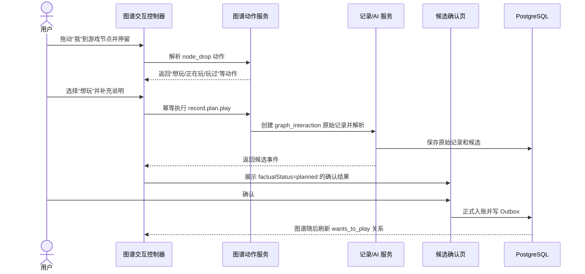
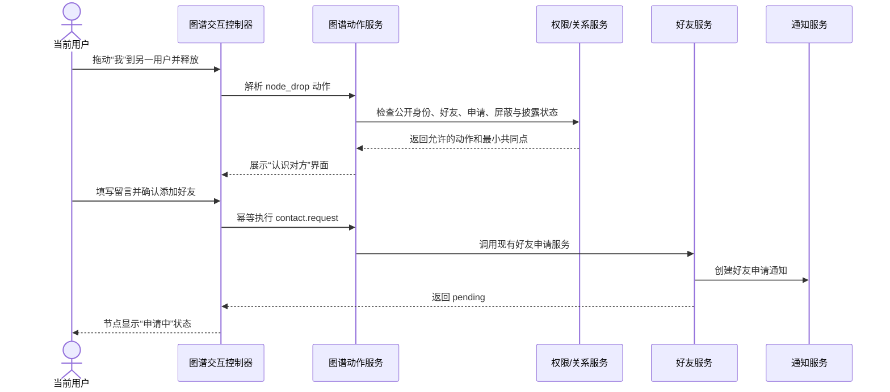

# 图谱交互动作系统设计

> 状态：架构设计稿  
> 日期：2026-08-11  
> 适用范围：世界关系图、个人关系图、关系模式、事件模式  
> 关联文档：[产品设计方案](./product-design.md)、[世界实体库与公共图谱同步设计](./world-entity-and-graph-sync-design.md)

## 1. 背景与目标

当前关系图已经支持世界/个人范围、关系/事件模式、搜索筛选、节点拖拽、缩放、聚焦和基础右键菜单，但交互主要停留在“查看”和“调整布局”。下一阶段需要让图谱成为可操作的生活界面：用户可以从人物、地点、游戏、书籍、App、事件和关系直接发起记录、联系、整理与探索。

典型目标包括：

- 右击其他用户，查看关系原因、申请好友、发消息或屏蔽。
- 把“我”拖到某个游戏上，快速形成“想玩这个游戏”的待确认记录。
- 把“我”拖到某个地点上，快速形成“想去”或“去过”的记录。
- 把“我”拖到另一位用户上，打开认识对方的界面，而不是直接建立关系。
- 在个人事件图中把一个事件拖到另一个事件上，建立“继续、因果、先后、重复”等事件关系。
- 把人物拖到自己的事件上，发起“添加参与者”的事件修订。
- 对节点、关系边和画布本身提供与上下文匹配的操作。

本设计的核心决定是：

> 不把右键、拖拽和碰撞分别实现为一组互不相干的前端逻辑，而是建立统一的“图谱动作系统”。手势只负责表达意图，服务端动作解析器负责给出当前用户真正可执行的动作，已有领域服务负责完成写入、授权、通知和审计。

## 2. 可行性结论

该能力可以在现有 React、AntV G6、Fastify 和 PostgreSQL 架构上实现，不需要更换图谱引擎或引入图数据库。

现有系统已经具备主要依赖：

- G6 提供节点拖拽、节点事件、画布事件、元素位置和状态控制。
- 图谱节点已经携带稳定节点 ID、节点类型、实体类别和资源元数据。
- 好友申请、好友关系、私聊、通知、屏蔽和限流已经形成服务闭环。
- 主动记录、AI 解析、候选确认、正式入账和草稿上限已经形成服务闭环。
- 正式事件支持计划、否定、不确定和已发生等事实状态。
- 事件修改使用版本化修订，图谱和社交投影可以重新计算。
- 世界图使用经过隐私过滤的公共投影，个人图使用账户私有事实。

需要新增的是统一动作协议、碰撞识别、快捷操作界面、少量领域适配接口以及交互审计，而不是重新设计核心数据所有权。

## 3. 设计原则

### 3.1 手势不等于提交

拖拽碰撞、双击和右键都只是打开动作界面，不能直接产生外部副作用。以下操作必须再次明确确认：

- 发送好友申请或邀请。
- 发送私聊消息。
- 创建、修改或删除生活事实。
- 公开内容、调整隐私或参与匹配。
- 合并实体、建立人物身份链接或修改共同经历。

### 3.2 继续遵守“先确认、后入账”

从图谱发起的“想玩”“去过”“和某人吃饭”等快捷记录，仍然进入：

```text
图谱动作 → 生成原始记录或结构化候选 → 展示解析结果 → 用户确认 → 正式事件
```

图谱动作可以预填实体引用和推荐字段，减少 AI 歧义，但不能绕过候选确认直接写入 `events`。

### 3.3 意图与事实严格区分

“想玩游戏 A”不能生成“玩过游戏 A”的事实关系。快捷动作需要保留动作语义：

| 用户动作 | 候选事实状态 | 推荐关系语义 |
| --- | --- | --- |
| 想玩 | `planned` | `wants_to_play` |
| 正在玩 | `ongoing` 或已发生事件 | `playing` |
| 玩过 | `occurred` | `played` |
| 喜欢 | 用户明确声明 | `likes` |
| 不感兴趣 | 用户明确声明或推荐偏好 | `not_interested` |

计划类记录不能计入“已经做过”的统计，后续完成计划时可以关联一个新的已发生事件。

### 3.4 服务端决定能力，前端只负责呈现

前端不能仅凭节点颜色或类别判断是否允许“添加好友”“查看事件”或“修改关系”。动作是否可见、是否可执行、需要哪些输入，都由服务端根据以下信息解析：

- 当前登录用户。
- 世界或个人图范围。
- 源节点与目标节点的真实资源类型。
- 好友、申请、屏蔽、共同经历和身份披露状态。
- 事件所有权和修订版本。
- 内容可见性、匹配和共同经历许可。
- 实体敏感性和当前状态。

### 3.5 世界图可操作，但不能变成隐私旁路

用户可以对世界图的公开节点发起自己的动作，例如收藏、创建个人记录或发送好友申请，但不能借此读取：

- 对方的原始记录和附件。
- 精确时间、精确坐标和私人别名。
- 未公开事件或私人关系证据。
- 匿名候选关系背后的账户身份。

### 3.6 拖拽既是布局操作，也是动作手势

不能让每一次节点重叠都弹窗。只有满足“明确碰撞意图”的拖放才触发动作预览；普通拖拽仍然只调整布局。

### 3.7 动作可撤销、可解释、可审计

所有持久化动作都需要幂等键、执行结果和来源记录。事实变化继续通过现有修订、撤权和 Outbox 机制传播，图谱交互本身不能成为第二套事实来源。

## 4. 统一交互词汇

### 4.1 手势类型

| 手势 | 用途 | 是否直接产生副作用 |
| --- | --- | --- |
| 单击节点 | 选中并查看详情 | 否 |
| 双击节点 | 聚焦直接关系或打开默认详情 | 否 |
| 右击节点 | 打开节点动作菜单 | 否 |
| 右击关系边 | 查看证据、隐藏或管理关系 | 否 |
| 右击画布 | 新建记录、重置布局、添加节点、导出视图 | 否 |
| 拖拽节点 | 调整布局 | 否 |
| 拖拽碰撞并停留 | 预览源节点与目标节点可用动作 | 否 |
| 在高亮目标上释放 | 打开动作选择器 | 否 |
| 长按节点 | 触屏设备上的右键替代 | 否 |
| 多选后打开动作栏 | 对多个节点发起组合记录或整理 | 否 |

### 4.2 动作类型

动作分为三类：

1. **本地视图动作**：聚焦、展开、隐藏、固定位置、复制名称、重置布局，不请求服务端。
2. **查询动作**：查看公开信息、关系原因、时间线证据、好友状态，需要服务端授权读取但不改变状态。
3. **命令动作**：发好友申请、创建记录草稿、修改事件、建立事件关系、加入圈子等，需要确认、幂等和审计。

## 5. 节点和关系动作矩阵

### 5.1 右击当前用户“我”

- 查看我的节点详情。
- 只看我的直接关系。
- 展开两层关系。
- 从这里开始记录。
- 查看别人眼中的公开资料与公开图谱投影。
- 打开隐私设置。
- 固定/取消固定中心位置。
- 恢复默认位置。

### 5.2 右击其他注册用户

动作根据关系状态动态变化：

| 状态 | 可用动作 |
| --- | --- |
| 无关系 | 查看公开名片、查看公开共同点、发送好友申请、不感兴趣、屏蔽、举报 |
| 已发送申请 | 查看申请状态、撤回申请、查看公开共同点 |
| 收到申请 | 查看申请、接受、拒绝 |
| 已是好友 | 发消息、记录共同经历、查看共同点、解除好友、屏蔽 |
| 已屏蔽或被屏蔽 | 不提供联系动作；仅显示受限状态和必要的解除屏蔽入口 |
| 匿名候选 | 只显示允许披露的共同原因、同意认识、暂不推荐；不能显示账户身份 |

“查看公开共同点”只能读取双方都获准展示的公共或社交投影证据。

### 5.3 右击人物实体

人物实体不一定对应平台注册用户：

- 查看与此人的事件和关系证据。
- 快速记录“和此人做了某事”。
- 添加别名或私人备注。
- 若存在待确认的账户身份链接，发起或处理身份关联。
- 在个人图中合并重复人物实体。
- 设置敏感、隐藏或不参与匹配。

### 5.4 右击地点

- 查看与该地点有关的事件。
- 快速记录“去过这里”。
- 记录“想去这里”。
- 记录“正在这里”——仍需用户确认，不能把浏览器定位或拖拽当作到访事实。
- 查看地点圈、公开趋势和已授权的公共事件。
- 收藏到个人图谱。
- 设置私人别名、敏感级别或匹配许可。
- 在世界图中隐藏该节点或减少相关推荐。

### 5.5 右击游戏、书、影视、音乐、App、食物等事物

动作模板由实体类别决定：

| 类别 | 快捷动作示例 |
| --- | --- |
| 游戏 | 想玩、正在玩、玩过、喜欢、不感兴趣 |
| 书籍 | 想读、正在读、读完、喜欢、写读后感 |
| 影视 | 想看、正在看、看过、喜欢、写观后感 |
| 歌曲/专辑 | 想听、正在听、听过、喜欢、加入回忆记录 |
| App/平台 | 想试试、使用过、经常使用、停止使用、记录一次使用 |
| 食物/饮品 | 想尝、吃过/喝过、喜欢、不喜欢、记录一次消费 |
| 普通事物 | 感兴趣、使用过、拥有、记录相关经历 |

通用动作还包括查看相关事件、查看公开趋势、加入相关圈子、隐藏节点和管理别名。

### 5.6 右击事件

世界图中的公开事件：

- 查看公开摘要和安全实体。
- 查看该事件公开关系。
- 以此为提示创建自己的记录。
- 收藏相关实体，而不是复制对方原始事件。
- 举报公开内容。

个人图中自己的事件额外支持：

- 打开时间线详情。
- 编辑事件并生成新修订版本。
- 修改参与人、实体、地点和隐私。
- 与另一事件建立关系。
- 关联共同经历。
- 删除事件并触发派生撤销。

### 5.7 右击共同经历

- 查看成员和各自授权的最小共享事实。
- 关联自己的既有事件。
- 新建一条个人记录并关联到共同经历。
- 邀请已知参与者。
- 管理自己的共享权限。
- 退出共同经历。

### 5.8 右击关系边

- 查看“为什么有关联”。
- 查看证据事件或公共证据摘要。
- 只聚焦这条关系及相邻节点。
- 在个人图中打开相关时间线。
- 隐藏系统推断关系。
- 撤回用户声明。
- 对错误关系提供纠正反馈。
- 对社交关系执行减少推荐、解除联系、屏蔽或举报。

不能允许用户直接删除事实派生边；应修改或删除其事实来源，再由投影重建关系。

### 5.9 右击画布

- 新建生活记录。
- 搜索并定位节点。
- 把一个实体加入个人图谱，作为收藏或计划候选。
- 清除选择、适应画布、重置布局。
- 保存当前视图布局。
- 导出当前可见图像；导出前再次应用隐私遮罩并标注导出时间。
- 切换性能模式、标签密度和关系线密度。

## 6. 拖拽碰撞动作矩阵

拖拽动作按“源节点 → 目标节点”解析。世界图和个人图可以返回不同动作。

### 6.1 “我”拖到其他用户

释放后打开“认识对方”动作卡，而不是立即添加好友：

- 对方公开名片。
- 当前关系状态。
- 可公开解释的共同点。
- 添加好友、处理申请或发消息。
- 记录一次共同经历——仅好友或已完成身份授权时可用。
- 暂不推荐、屏蔽、举报。

若目标是匿名候选，只能打开匿名认识流程，不能因碰撞披露真实账户。

### 6.2 “我”拖到事物

打开类别化快捷记录卡。例如游戏节点提供：

```text
想玩 / 正在玩 / 玩过 / 喜欢 / 写点别的
```

选择“想玩”后，系统生成预填记录：

```json
{
  "source": "graph_interaction",
  "text": "我想玩《游戏 A》",
  "intent": "wants_to_play",
  "factualStatus": "planned",
  "canonicalEntityId": "..."
}
```

随后进入现有 AI 候选确认页。标准实体 ID 作为可信上下文传给解析器，AI 不再重新猜测游戏名称，但用户仍可修改或删除。

### 6.3 “我”拖到地点

推荐动作：

- 想去。
- 去过。
- 记录在这里发生的事。
- 收藏地点。
- 查看地点圈。

“去过”和“正在这里”都不能从拖拽直接推断；用户必须补充时间或确认系统生成的候选。

### 6.4 “我”拖到事件或共同经历

- 对公开事件：以此为提示创建自己的记录、收藏其中实体。
- 对自己的事件：打开事件详情或补充一条后续记录。
- 对共同经历：创建个人记录并申请关联。

### 6.5 其他用户拖到事物

仅提供查询或沟通动作：

- 查看该用户与事物之间可公开的关系。
- 查看双方在该事物上的公开共同点。
- 已是好友时，可以“聊聊这个”，打开私聊并附带一个实体卡片草稿。
- 邀请好友加入相关圈子。

不能因为把别人拖到某个游戏上，就替对方创建偏好或生活事实。

### 6.6 人物拖到自己的事件

在个人图中打开“添加参与者”修订界面：

- 默认预填人物实体。
- 用户选择角色，例如同行、主要参与者、提及。
- 保存时生成事件新版本。
- 若人物关联注册账户，共同经历仍需对方单独同意。

世界图不提供修改他人公开事件参与者的动作。

### 6.7 事件拖到事件

只在个人图且至少一个事件归当前用户时开放。可建立：

- 之前/之后。
- 同时发生。
- 导致。
- 继续。
- 中断。
- 重复。
- 引用。
- 包含。

该动作复用 `event_relations`，需要显示双方事件标题和关系方向，避免把 A 导致 B 保存成 B 导致 A。

### 6.8 事件拖到共同经历

- 检查事件所有权。
- 检查共同经历成员资格和授权。
- 打开最小事实共享预览。
- 用户确认后创建或恢复 `event_occurrence_links`。

### 6.9 同类实体互相碰撞

个人图中可提供：

- 比较两个实体。
- 标记为可能重复。
- 打开“图鉴”中的合并流程。
- 建立用户声明关系，例如“游戏 A 类似游戏 B”。

实体合并是高风险操作，碰撞只能打开比较页，不能直接合并。

### 6.10 多节点组合拖拽

后续支持 Shift 多选人物、地点和事物，再拖到“我”或记录入口，生成组合记录草稿，例如：

```text
我 + 小王 + 商店 A + 猪肉包子
→ “和小王在商店 A 吃了猪肉包子”
```

系统只能把选中的节点作为候选上下文，最终语句、时间、角色和事实状态仍需用户确认。

## 7. 碰撞识别与交互反馈

### 7.1 明确碰撞意图

推荐判定条件：

1. 当前处于节点拖拽状态。
2. 源节点和目标节点中心距离小于二者碰撞半径之和。
3. 形状包围盒重叠比例达到约 30%，或中心进入目标热区。
4. 在目标热区连续停留 450～650 毫秒。
5. 该节点组合至少存在一个可用动作。

只有全部满足后，目标节点才进入 `drop-ready` 状态。用户在进入该状态后释放，才打开动作卡。

### 7.2 视觉反馈状态

```text
idle → dragging → collision-candidate → drop-ready → action-sheet
                     ↓ 离开目标
                   dragging
```

- `dragging`：源节点略微抬升，其他无关节点降低透明度。
- `collision-candidate`：目标节点出现微弱外环。
- `drop-ready`：目标节点出现明确高亮，并显示“松开以选择操作”。
- `invalid-target`：不弹窗，可使用短暂灰色反馈，不使用红色错误打断拖拽。
- `action-sheet`：节点恢复稳定位置，打开动作选择器。

不使用无限呼吸、粒子或持续力导动画。只有状态切换时执行 120～180 毫秒短动画，并尊重 `prefers-reduced-motion`。

### 7.3 避免与布局拖拽冲突

- 没有停留到阈值，释放后只保存节点位置。
- 进入 `drop-ready` 后再释放，触发动作卡。
- 动作取消后默认保留用户拖拽后的布局；动作卡提供“同时复位节点”选项。
- 用户可在设置中关闭“拖拽碰撞快捷操作”，保留纯布局拖拽。
- 触屏设备使用长按进入拖拽动作模式，普通单指拖拽优先平移画布。

### 7.4 防止重复触发

- 同一次拖拽只允许一个活动目标。
- 动作卡打开后锁定该次手势。
- 相同源、目标和动作在 800 毫秒内不重复解析。
- 命令执行使用客户端 UUID 幂等键，网络重试不会重复发好友申请或创建多条草稿。

## 8. 交互界面

### 8.1 节点右键菜单

右键菜单只显示 4～6 个最常用动作：

- 第一组：查看、聚焦、展开。
- 第二组：与节点类型相关的主要动作。
- 第三组：管理、屏蔽、举报等次要动作。
- “更多操作”打开完整动作面板。

菜单项需要支持：图标、名称、补充说明、快捷键、禁用原因和危险级别。不可执行但有解释价值的动作可以显示禁用原因；完全不该披露的动作直接不返回。

### 8.2 碰撞动作卡

碰撞释放后在节点附近打开轻量浮层；复杂操作升级为右侧抽屉或居中对话框。动作卡包含：

- 源节点与目标节点。
- 系统对本次组合的解释。
- 2～5 个推荐动作。
- “写点别的”自由文本入口。
- 取消与必要的确认说明。

### 8.3 快捷记录抽屉

快捷记录不是完整记录页面的复制，而是预填层：

- 一句话预览。
- 事实状态，例如计划、正在发生、已经发生。
- 相关人物、地点和事物标签。
- 可选时间。
- “继续补充”进入完整记录页。
- “生成解析结果”进入既有 AI 确认流程。

用户最终仍然看到标准候选确认界面。

### 8.4 认识对方界面

“我”与用户节点碰撞后展示：

- 头像/占位图、显示名和用户名；匿名候选不展示身份字段。
- 当前好友或申请状态。
- 经过隐私过滤的共同点摘要。
- 添加好友、处理申请或发消息。
- 屏蔽、举报和减少推荐。

好友申请可以附加不超过 240 字的留言，并复用现有通知中心。

## 9. 前端架构

### 9.1 模块划分

```text
GraphView
├── GraphRendererAdapter
│   └── G6 事件、位置、状态和绘制
├── GraphInteractionController
│   ├── 右键/双击/长按解释
│   ├── 拖拽碰撞检测
│   └── 交互状态机
├── GraphActionResolverClient
│   └── 请求动作能力与执行命令
├── GraphContextMenu
├── GraphCollisionPreview
├── GraphActionSheet
├── GraphQuickRecordDrawer
└── GraphInteractionToast
```

`GraphView` 不继续堆叠所有逻辑。G6 适配器只产生统一事件：

```ts
type GraphGesture =
  | { type: "node_context"; nodeId: string; point: ScreenPoint }
  | { type: "edge_context"; edgeId: string; point: ScreenPoint }
  | { type: "canvas_context"; point: ScreenPoint }
  | { type: "node_drop"; sourceNodeId: string; targetNodeId: string; point: ScreenPoint };
```

### 9.2 碰撞检测

小规模图谱可在拖拽帧中遍历当前可见节点；节点增加后切换到空间索引：

- 仅在拖拽发生时计算。
- 每个动画帧最多计算一次。
- 只处理视口内、可交互的节点。
- 使用节点包围盒或圆形近似热区。
- 超过约 300 个可见节点时使用四叉树或网格索引查询附近目标。
- 不因碰撞检测启动全图布局或全量 React 重渲染。

候选目标和拖拽状态放在 `ref` 或独立控制器中，仅在状态跨越阶段时更新 React UI。

### 9.3 本地动作注册

聚焦、隐藏、复位等动作在前端注册：

```ts
type LocalGraphAction = {
  id: string;
  supports(context: GraphActionContext): boolean;
  execute(context: GraphActionContext): void | Promise<void>;
};
```

任何领域写操作不得注册为纯本地动作。

### 9.4 图谱刷新策略

- 本地布局动作立即生效。
- 查询动作不刷新图谱。
- 好友申请仅更新目标节点关系状态和菜单，不重新拉取全图。
- 快捷记录在用户确认入账后，根据服务端返回的受影响节点/边做局部更新；必要时后台刷新图谱。
- 修改隐私、删除事件或合并实体后，以服务端投影结果为准，不做不可逆的乐观关系修改。

## 10. 服务端动作架构

### 10.1 模块划分

新增 `graph-action` 领域适配层，但不复制已有业务：

```text
GraphActionRoutes
└── GraphActionService
    ├── NodeReferenceResolver
    ├── GraphActionRegistry
    ├── GraphActionPolicyGateway
    ├── GraphActionAuditWriter
    └── Domain Command Adapters
        ├── EntryAdapter
        ├── ContactAdapter
        ├── ConversationAdapter
        ├── EventLifecycleAdapter
        ├── SharedOccurrenceAdapter
        ├── EntityMemoryAdapter
        └── CircleAdapter
```

动作服务只负责解释“当前上下文允许调用哪个现有领域命令”，不直接操作好友、事件和实体表。

### 10.2 动作注册表

动作定义保存在版本化代码注册表中，不把业务规则全部配置到数据库：

```ts
type GraphActionDefinition = {
  id: string;
  version: number;
  gestures: GraphGestureType[];
  source: NodeSelector;
  target?: NodeSelector;
  scopes: ("world" | "personal")[];
  effect: "local" | "query" | "command";
  inputSchema?: ZodSchema;
  resolve(context: ResolvedGraphContext): Promise<ActionAvailability>;
  execute?(context: AuthorizedActionContext): Promise<GraphActionResult>;
};
```

实体类别对应的快捷文案可使用配置表，但权限、所有权和状态转换必须留在代码与数据库约束中。

### 10.3 节点引用解析

前端提交的是不透明图谱节点 ID，服务端重新解析为真实资源：

```ts
type ResolvedNodeReference =
  | { kind: "account"; userId: string }
  | { kind: "event"; eventId: string; ownerUserId: string }
  | { kind: "canonical_entity"; entityId: string; entityType: string }
  | { kind: "user_entity"; entityId: string; ownerUserId: string }
  | { kind: "shared_occurrence"; occurrenceId: string }
  | { kind: "social_match"; matchId: string };
```

服务端不接受前端提交的 `ownerUserId`、好友状态、公开状态或实体敏感级别作为可信事实。

### 10.4 权限网关

每个动作至少检查：

- 登录身份和账号状态。
- 节点是否属于当前图谱快照且仍然有效。
- 世界图节点是否仍在公共投影中。
- 事件所有权或共享成员权限。
- 好友、申请和双向屏蔽状态。
- 内容可见性和身份披露许可。
- 实体是否敏感、禁止匹配或已被重定向。
- 动作频率、幂等键和防滥用规则。

解析动作时可以为了体验返回禁用原因；执行动作时必须重新检查，不能信任之前的解析结果。

## 11. API 设计

### 11.1 解析动作

```http
POST /api/graph/actions/resolve
```

```json
{
  "scope": "world",
  "mode": "relationships",
  "gesture": "node_drop",
  "sourceNodeId": "user:current",
  "targetNodeId": "entity:game-id",
  "graphRevision": "opaque-revision"
}
```

返回：

```json
{
  "contextId": "short-lived-opaque-id",
  "expiresAt": "2026-08-11T13:10:00Z",
  "source": { "id": "...", "label": "我", "kind": "user" },
  "target": { "id": "...", "label": "游戏 A", "kind": "entity", "category": "game" },
  "actions": [
    {
      "id": "record.plan.play",
      "label": "想玩",
      "description": "生成一条计划记录，确认后入账",
      "presentation": "quick_record",
      "enabled": true,
      "input": { "fields": ["note", "time"] }
    }
  ]
}
```

`contextId` 只短期保存解析所需的不透明上下文，不能替代执行时权限检查。

### 11.2 执行动作

```http
POST /api/graph/actions/execute
Idempotency-Key: <uuid>
```

```json
{
  "contextId": "...",
  "actionId": "record.plan.play",
  "input": {
    "note": "朋友推荐的",
    "occurredStart": null
  }
}
```

统一返回结果联合类型：

```ts
type GraphActionResult =
  | { type: "entry_candidates"; entryId: string; candidates: CandidateRecord[] }
  | { type: "friend_request"; requestId: string; status: string }
  | { type: "conversation"; conversationId: string }
  | { type: "event_revision"; eventId: string; version: number }
  | { type: "navigation"; destination: string; resourceId?: string }
  | { type: "graph_patch"; nodes: GraphNode[]; edges: GraphEdge[]; removedIds: string[] };
```

### 11.3 批量能力提示

图谱加载时可以附带低成本的 `capabilityHints`，用于显示右键入口和拖拽光标；真正打开菜单时再调用解析接口。这样避免为每个可见节点单独发请求，也避免前端把提示当成授权结论。

### 11.4 错误协议

```json
{
  "code": "ACTION_NO_LONGER_AVAILABLE",
  "message": "对方的关系状态已经变化，请刷新后重试",
  "recover": "refresh_target"
}
```

建议错误码包括：

- `ACTION_NOT_SUPPORTED`
- `ACTION_NO_LONGER_AVAILABLE`
- `NODE_NOT_VISIBLE`
- `PRIVACY_DENIED`
- `RELATIONSHIP_REQUIRED`
- `BLOCKED_RELATIONSHIP`
- `DRAFT_LIMIT_REACHED`
- `EVENT_VERSION_CONFLICT`
- `RATE_LIMITED`
- `IDEMPOTENCY_CONFLICT`

## 12. 数据模型

### 12.1 不新增通用“图谱事实表”

图谱动作产生的领域结果继续写入现有事实表：

- 快捷记录：`raw_entries`、`raw_entry_contents`、`event_candidates`，确认后进入 `events`。
- 好友申请：`friend_requests`。
- 好友关系：`social_connections`。
- 私聊：`direct_conversations`、`direct_messages`。
- 事件关系：`event_relations`。
- 共同经历：`shared_occurrences`、`event_occurrence_links`。
- 用户声明：`user_assertions`。
- 实体整理：现有实体合并、拆分和别名操作表。

不能建立一张含义模糊的 `graph_edges_created_by_user` 表来绕开领域模型。

### 12.2 新增交互审计表

建议新增 `graph_interaction_audits`：

| 字段 | 说明 |
| --- | --- |
| `id` | UUID |
| `owner_user_id` | 发起者 |
| `gesture_type` | 右键、碰撞、长按、多选等 |
| `action_id` | 版本化动作 ID |
| `action_version` | 动作定义版本 |
| `scope` | 世界或个人 |
| `source_ref` | 最小化源资源引用 |
| `target_ref` | 最小化目标资源引用，可空 |
| `idempotency_key` | 命令幂等键，可空 |
| `status` | `resolved`、`cancelled`、`succeeded`、`failed`、`denied` |
| `result_type` | 草稿、好友申请、修订等，不保存敏感结果正文 |
| `failure_code` | 结构化错误码 |
| `metadata` | 客户端版本、耗时等非敏感技术字段 |
| `created_at` | 创建时间 |

审计表不保存原始记录正文、私聊内容、精确位置或对方私人信息。产品埋点可以从该表或独立匿名分析流生成，但安全审计与产品分析保留周期应分开。

### 12.3 原始记录来源

建议给 `raw_entries` 增加或复用来源字段：

```text
manual_text / voice / mixed / graph_interaction
```

同时保存最小化 `source_context`：动作 ID、标准实体 ID 和图谱范围。该上下文用于解析可解释性，不作为用户已经表达某项事实的替代证据。

## 13. 快捷记录生成规则

### 13.1 模板与 AI 的边界

图谱动作已经明确目标实体和粗意图，应采用“确定字段锁定、自然语言补全、AI 解析剩余字段”的方式：

- 标准实体 ID、实体类别、动作意图由动作上下文确定。
- 用户补充文本、时间、人物和感受。
- AI 解析事件类型、标题、时间范围、角色和扩展字段。
- Schema 校验器确认 AI 没有把计划误判成已发生，也没有替换锁定实体。
- 确认页展示“来自图谱快捷操作”的来源提示。

### 13.2 类别模板注册表

```ts
type QuickRecordTemplate = {
  actionId: string;
  entityTypes: string[];
  defaultText(entityName: string): string;
  factualStatus: "planned" | "occurred" | "ongoing" | "uncertain";
  eventType: string;
  relationRole: string;
};
```

模板是体验层默认值，用户可以选择“写点别的”回到通用自然语言输入。

### 13.3 草稿上限

图谱快捷记录必须复用现有最多 30 条待确认限制。达到上限时：

- 动作解析可以显示“需要先处理待确认记录”。
- 执行接口返回 `DRAFT_LIMIT_REACHED`。
- 界面提供跳转到待确认列表，不静默丢失用户输入。

## 14. 隐私、安全与防滥用

### 14.1 跨用户动作

- 拖拽碰撞不能自动发送好友申请。
- 好友申请必须显示目标身份和留言预览并明确确认。
- 匿名候选必须先完成身份披露同意，不能通过节点 ID 猜出用户 ID。
- 被任一方屏蔽后，联系、私聊、邀请和共同经历动作立即不可用。
- 好友申请和邀请复用现有限流，并按动作入口统一计数。

### 14.2 世界图内容

- 动作解析只能基于公共图谱和允许的社交投影。
- 右键“为什么有关联”只返回降精度、可解释的公共证据。
- 世界图节点 ID 应视为不透明标识，接口不得通过顺序 ID 暴露资源存在性。
- 公开事件被撤回后，旧菜单上下文立即失效。

### 14.3 快捷记录

- 创建的是当前用户自己的草稿，不修改目标实体或其他用户数据。
- 对某用户发起“记录共同经历”不能替对方确认参与。
- 地点快捷记录不能自动附加当前精确定位，除非用户主动点击定位并授权。
- AI 只接收快捷记录所需的最小实体上下文。

### 14.4 高风险动作

删除、合并、屏蔽、退出共同经历和公开隐私变更需要危险操作确认。图谱碰撞不提供“拖到垃圾桶直接删除”的模式，避免误操作和数据不可恢复。

## 15. 性能设计

### 15.1 前端

- 碰撞检测仅在拖拽时开启，使用 `requestAnimationFrame` 节流。
- 不开启 G6 全局自动渲染和无限动画。
- 只给源节点、当前候选目标和相邻边设置状态。
- 动作菜单使用 React DOM 浮层，不把复杂表单绘制进 Canvas。
- 动作能力按需解析并短期缓存，缓存键包含用户、范围、节点对和关系版本。
- 取消、切换范围或图谱数据刷新时中止未完成请求。

### 15.2 服务端

- 解析接口不扫描完整图谱，只解析两个资源引用和必要关系状态。
- 好友、屏蔽、所有权和策略检查使用现有索引。
- `contextId` 使用短期缓存或签名载荷，过期时间建议 2～5 分钟。
- 执行接口只调用一个明确领域命令，禁止通用动态 SQL。
- 审计写入与领域命令同事务保存关键结果，非关键产品埋点可异步。

### 15.3 大图策略

图谱规模增长后，碰撞交互只作用于已经加载的视口节点。服务器端仍将全站公共图谱视为完整语义空间，但客户端不需要为未加载节点计算碰撞或动作能力。

## 16. 两个关键流程

### 16.1 “我”拖到游戏，记录想玩



### 16.2 “我”拖到其他用户，认识对方



## 17. 无障碍与移动端

- 所有右键动作必须也能从节点详情的“更多操作”按钮进入。
- 拖拽碰撞不是唯一入口；键盘用户可选中源节点后选择“与其他节点交互”，再搜索目标。
- 菜单使用正确的 `menu`、`menuitem` 和焦点循环语义。
- Esc 关闭菜单或动作卡并恢复焦点。
- 触屏使用长按菜单和显式“交互”按钮，不能依赖悬停。
- 碰撞高亮不能只依赖颜色，同时使用外环、形状变化或文字提示。
- 动画遵守系统减少动态效果设置。

## 18. 测试策略

### 18.1 单元测试

- 节点组合到动作定义的匹配。
- 世界/个人范围差异。
- 实体类别快捷模板。
- 碰撞阈值、停留计时和取消。
- 交互状态机的合法转换。
- 错误码到界面恢复动作的映射。

### 18.2 服务测试

- 不同好友申请状态下返回正确动作。
- 屏蔽、隐私撤回和事件删除后动作立即失效。
- 匿名候选不会返回账户身份。
- 幂等重试只创建一个好友申请或一个原始记录。
- 计划记录不会生成“已经玩过”关系。
- 图谱快捷记录达到 30 条草稿上限时被阻止。
- 事件关系方向和乐观锁版本冲突。

### 18.3 浏览器交互测试

- 普通拖拽不误触碰撞动作。
- 停留并释放能够打开正确动作卡。
- 取消后节点和图谱仍可继续操作。
- 右键菜单不会超出视口。
- 缩放和平移后碰撞坐标仍正确。
- 世界/我切换时旧动作请求被取消。
- 低性能设备上拖拽期间 CPU 和帧率保持可接受。
- 键盘、触屏和减少动态效果模式可完成等价操作。

## 19. 实现顺序

实现顺序用于降低返工风险，不限制最终能力：

### 阶段 A：动作基础设施

- 拆出 `GraphInteractionController`。
- 建立动作注册表、解析接口、执行接口、幂等和审计。
- 扩展右键菜单，接入本地动作和查询动作。
- 给节点资源引用增加稳定、不可伪造的解析方式。

### 阶段 B：核心碰撞闭环

- 实现碰撞检测、停留反馈、释放动作卡。
- 完成“我 → 用户”的认识界面并复用好友服务。
- 完成“我 → 游戏/书/影视/App/地点”的快捷记录。
- 确认快捷记录完整经过 AI 候选确认和草稿上限。

### 阶段 C：个人图谱编辑动作

- 人物 → 事件的参与者修订。
- 事件 → 事件的事件关系。
- 事件 → 共同经历的授权关联。
- 同类实体碰撞进入图鉴比较与合并流程。

### 阶段 D：组合与高级动作

- 多选节点生成组合记录。
- 关系边右键证据管理。
- 实体卡片分享到好友私聊草稿。
- 保存个人布局、导出隐私安全视图。
- 空间索引和大图按视口加载优化。

## 20. 验收标准

满足以下条件才视为图谱动作系统完成基础闭环：

1. 同一动作可以从右键和拖拽碰撞两种入口进入，最终调用同一领域命令。
2. 普通拖拽不会频繁误触动作卡。
3. “我 → 游戏 → 想玩”生成计划候选，用户确认前不进入正式事件和图谱关系。
4. “我 → 用户”只打开认识界面，确认后才发送好友申请。
5. 已是好友、申请中、收到申请、匿名候选和屏蔽状态分别显示正确动作。
6. 世界图动作不能读取私人事件、附件、精确时间和位置。
7. 所有命令支持幂等，网络重试不会重复写入。
8. 删除、撤权、屏蔽和关系变化后旧动作上下文立即失效。
9. 碰撞检测不会恢复持续动画，也不会显著提高空闲 CPU。
10. 鼠标、键盘和触屏都能完成主要动作。

## 21. 最终架构决策

- 使用统一图谱动作系统，不为每种手势单独编写业务写入逻辑。
- G6 只负责渲染、命中和拖拽事件，业务能力由 React 控制器和服务端动作服务承担。
- 右键和碰撞只是动作入口，任何生活事实仍需用户确认后入账。
- 世界图允许用户基于公开节点创建自己的记录或联系请求，但不扩张数据可见范围。
- 好友、消息、事件、实体和共同经历继续使用现有领域服务及事实表。
- 新增交互审计，不新增含义模糊的图谱事实表。
- 先实现“我 → 用户”和“我 → 实体”的高价值闭环，再扩展事件关系、参与者修订和多节点组合。

这一设计使图谱从静态浏览器升级为生活操作界面，同时保持织络最重要的边界：用户主动表达、确认后入账、跨用户双向同意、隐私默认收紧、所有派生关系可解释和可撤销。
