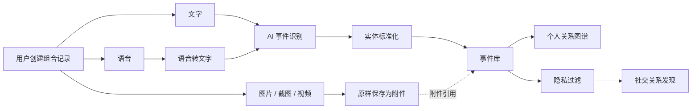
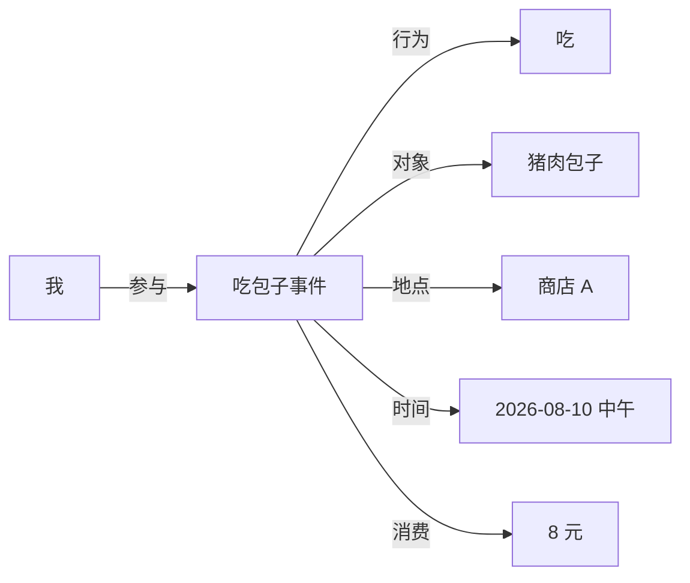
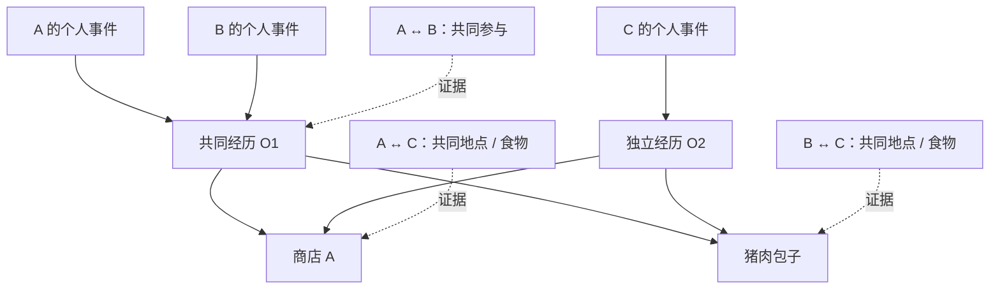
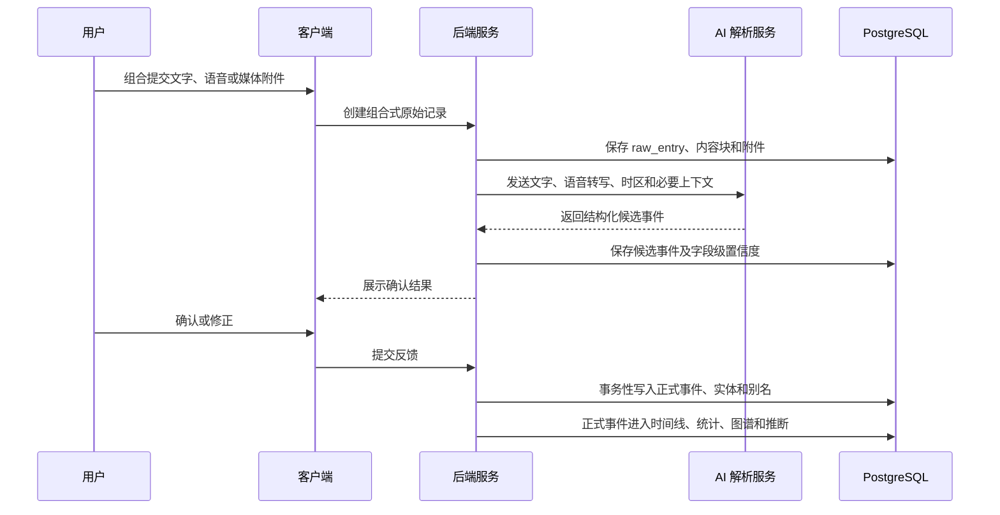
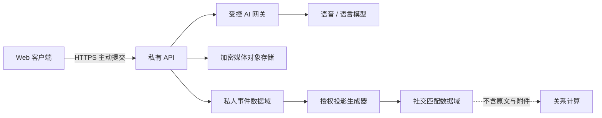

# TraceWeave 产品设计方案

> 通过自然语言持续记录生活，把每句话转成结构化事件，并逐渐生成个人关系图谱和隐私可控的社交关系网。

## 1. 文档信息

| 项目 | 内容 |
| --- | --- |
| 文档状态 | 架构决策基线 v1.1，已完成 10 轮确认及首次代码实现审计 |
| 当前阶段 | 主动记录到授权连接的纵向主链已经可运行；全量功能与生产治理仍处于部分实现阶段 |
| 核心原则 | 主动记录、事件优先、默认私密、用户可纠正、推断可解释 |
| 产品建设顺序 | 记录 → 理解 → 连接 |

## 2. 产品定位

TraceWeave 是一个会自动理解用户的全域 AI 生活流水账。用户只需要用自然语言讲述发生过的事情，系统就能把现实活动和数字活动统一整理成事件、实体与关系，生成生活回顾，并在用户明确授权的情况下发现具有共同经历或兴趣的人。

“流水账”不是贬义或过渡形态，而是产品的基础形态：任何值得记住的生活片段都可以按发生顺序进入系统。关系图谱不是流水账的替代品，而是从长期事件中派生出的组织和探索方式。

产品架构不绑定单一垂直场景。去哪里、和谁吃了什么，以及使用什么 App、刷了什么视频、玩了什么游戏、看了什么书、听了什么歌，都应使用同一套通用事件骨架表达；各领域的特殊字段通过可扩展类型系统承载。

### 2.1 核心用户价值

- 快速记录：用文字、语音和媒体附件完成接近“给自己发消息”的组合记录体验。
- 全域记录：同时覆盖线下经历、线上活动、内容消费、创作、工作、学习、娱乐和社交互动。
- 自动理解：从自然语言中识别人物、时间、地点、行为、对象、内容、软件、设备、金额、时长和情绪等信息。
- 长期记忆：识别同一人物、地点和事物的不同称呼，形成持续积累的个人语义记忆。
- 生活回顾：支持时间线、统计、自然语言查询、周报和月报。
- 安全连接：在用户授权的边界内，通过匿名匹配发现共同兴趣、共同地点和共同经历。

### 2.2 核心产品假设

- 用户愿意持续记录的前提，是输入足够快、AI 识别结果易于纠正。
- 用户留存的主要动力来自有价值的回顾和记忆，而不是图谱视觉效果。
- 社交功能必须建立在明确授权、最小披露和双向同意基础上。
- “用户明确表达”与“系统推断”必须分开存储和展示。
- 通用事件模型必须允许未知活动类型和未知字段进入系统，不能因为当前产品尚无对应页面而丢弃信息。
- 先完成覆盖全面、边界清晰的目标架构，再根据价值与成本确定交付顺序；阶段裁剪不应反向限制底层数据模型。
- 记录行为本身是产品价值的一部分。系统帮助用户养成主动回顾和表达生活的习惯，而不是用后台数据采集取代记录行为。

### 2.3 架构设计边界

- 当前先尽量覆盖完整产品能力，后续再确定版本范围和开发优先级。
- 全量架构需要容纳社交网络、个人记忆和多领域事件，但不包含后台行为监控或被动生活采集。
- 架构不预设必须使用图数据库；在验证查询需求后，决定 PostgreSQL 与图数据库的职责边界。
- 图谱不作为唯一或默认入口，而是作为长期积累后的探索视图。
- 在缺少用户确认时，不自动合并低置信度的人物、地点等敏感实体。

## 3. 产品核心结构

产品由三个数据层和一个受控连接出口组成：

1. 原始记录层：以一条组合记录为容器，保存用户输入的文字、语音、图片、截图、视频、创建时间和用户明确选择的上下文。
2. 语义事件层：AI 将一条原始记录解析为一个或多个结构化事件。
3. 关系图谱层：从事件中积累用户与人物、地点、食物、活动、兴趣等实体的关系。
4. 隐私与社交层：经过隐私过滤后，才允许生成匿名统计、圈子或潜在关联。

### 3.1 主动记录边界

每条原始记录必须由用户的一次明确操作发起。系统不在后台读取并生成用户的 App 使用、定位轨迹、播放历史、浏览记录、支付记录、聊天记录、健康数据或穿戴设备数据，也不通过绑定第三方账号持续同步这些行为。

系统可以保存完成一次主动记录所必需的操作元数据，例如记录创建时间、输入方式和用户明确选择附带的信息；这些元数据不能扩展为后台连续追踪。

“用户说自己刚看了某个视频”是生活事件；“系统发现用户播放了某个视频并自动入账”不属于本产品。外部服务如被使用，应只用于理解用户已经主动提交的内容，例如补全书籍作者或歌曲专辑信息，而不能用于发现用户没有主动记录的行为。



### 3.2 组合式原始记录

一条 `raw_entry` 是用户一次主动记录的容器，可以只包含一种输入，也可以按顺序组合多段文字、语音和媒体附件。系统保留各内容块的原始顺序，从而表达“先说一句话，再补一张照片，又追加一段语音”的完整上下文。

- 文字直接进入事件解析。
- 语音先转写，原始音频与转写文本同时保留，转写文本进入事件解析。
- 拍照、相册图片、截图和视频只作为记录附件及事件证据保存。
- 媒体附件不执行 OCR、画面识别、语音提取或多模态事件推断。
- 媒体文件只提取存储和播放所必需的技术元数据，例如 MIME 类型、文件大小、尺寸和视频时长；这些元数据不用于推断用户行为。
- 如果用户希望表达附件内容，需要在同一条组合记录中用文字或语音说明，系统只解析这部分明确表达。

## 4. 事件优先的数据模型

### 4.1 为什么事件必须是独立节点

系统不应只保存“我 → 吃过 → 包子”。这种简单三元组无法完整承载时间、地点、数量、价格、同行人、评价和信息来源。

事件应作为独立节点，与参与者、行为、对象、地点、时间及金额建立关系：



这样才能稳定支持：

- 我最近吃了几次包子？
- 我在哪家店吃包子最多？
- 我在饮食上花了多少钱？
- 我多久没去商店 A 了？
- 哪些人的饮食偏好和我相似？

### 4.2 事件解析示例

用户输入：

> 今天中午我在商店 A 花了 8 块钱吃了两个猪肉包子。

建议解析结果：

```json
{
  "event_type": "eat",
  "actor": "current_user",
  "time": {
    "value": "2026-08-10T12:00:00+08:00",
    "precision": "period_of_day",
    "source": "user_expression"
  },
  "place": {
    "mention": "商店A",
    "entity_id": null
  },
  "objects": [
    {
      "mention": "猪肉包子",
      "entity_id": null,
      "category": "food",
      "quantity": 2,
      "unit": "个"
    }
  ],
  "amount": 8,
  "currency": "CNY",
  "confidence": 0.94,
  "raw_text": "今天中午我在商店A花了8块钱吃了两个猪肉包子"
}
```

除字段值外，系统应保存时间精度、识别来源、置信度和原文片段，避免把模糊表达伪装成精确事实。

### 4.2.1 主动定位与事件地点

定位是用户主动附加的原始上下文，不应直接等同于事件发生地。系统必须分开表达：

- `occurred_at`：用户确认事情发生在该位置，可以成为个人图谱的事件地点边。
- `recorded_at`：只表示用户在该位置记录了一件事，不能作为事件发生地点或社交证据。
- `none`：对某个候选事件不建立位置关系，适用于一条记录被拆成多个事件的情况。

浏览器定位结果作为 `location_observation` 保存，包含坐标、精度、采集时间、用户标签、来源和敏感级别；用户确认后再通过 `event_location_link` 与正式事件连接。原始坐标与 AI 识别出的地点实体保持分离，避免把“当前位置”、记录位置或低精度坐标误合并为公共地点。

只有用户主动开启匿名地点匹配，位置才生成粗粒度空间单元。精确坐标不进入社交投影，当前粗粒度单元约覆盖一公里范围；住址、医院、学校、宗教场所等敏感标签由后端强制排除。生成社交关系证据时还必须同时满足事件已确认、关系角色为 `occurred_at`、位置允许匹配和用户隐私策略允许匹配。

传给事件解析模型的位置上下文只包含用户填写的地点标签与关联角色，不发送经纬度。没有地点标签时，模型不得根据坐标或“当前位置”编造地点名；坐标关系由确定性的数据库边表达，而不是由模型推断。

### 4.3 一条记录与多个事件

一句话可能包含多个事件，例如：“下班后和小王去商店 A 吃了包子，后来又看了场电影。”系统应允许一条 `raw_entry` 对应多个 `event`，并保留事件之间的先后或因果关系。

### 4.4 通用事件信封与领域扩展

为了支持“什么都可以记录”，事件不能采用一张无限增加专用列的大表，也不能完全依赖无约束 JSON。建议采用“稳定的通用事件信封 + 类型化关系 + 版本化领域扩展”的混合模型。

所有事件共享的稳定字段包括：

- 身份：事件 ID、所属用户、原始记录 ID、父事件 ID。
- 类型：事件大类、具体活动类型、类型版本。
- 动作语义：参与者、动作、对象，以及参与者和对象在事件中的角色。
- 时间：开始时间、结束时间、时长、时区、时间精度和来源。
- 空间与环境：现实地点、线上空间、设备、平台和客户端。
- 事实状态：已发生、正在发生、计划、取消、否定、不确定或推测。
- 主观体验：情绪、评分、评价、喜欢程度和用户备注。
- 度量：数量、金额、距离、时长、进度等带单位数值。
- 来源与证据：用户主动提交的文字、语音转写，以及不参与语义解析的原始音频、图片、截图和视频附件。
- 质量：字段级置信度、确认状态、解析模型和 Schema 版本。
- 治理：隐私级别、匹配许可、敏感标记、保留策略和删除状态。

领域扩展用于表达不同活动的特殊语义，例如：

| 领域 | 事件示例 | 典型对象与扩展字段 |
| --- | --- | --- |
| 出行与到访 | 去了公园、坐地铁上班 | 地点、路线、交通方式、距离 |
| 饮食与消费 | 和小王吃包子、买了咖啡 | 食物、商家、同行人、数量、金额 |
| App 使用 | 玩了半小时某 App | App、设备、会话时长、使用目的 |
| 视频观看 | 刷了短视频、看了一集剧 | 视频、作者、平台、剧集、观看进度 |
| 游戏 | 玩了某游戏、完成一局对战 | 游戏、模式、角色、局次、结果、时长 |
| 阅读 | 看了某本书的三章 | 作品、版本、章节、页码、阅读进度 |
| 音乐与音频 | 听了某首歌或播客 | 曲目、艺人、专辑、节目、单集、时长 |
| 社交互动 | 和朋友见面、给同事打电话 | 人物、关系、沟通方式、话题 |
| 学习与工作 | 学了一门课、完成一个任务 | 课程、项目、任务、产出、进度 |
| 身体与情绪 | 跑步、睡眠、感到开心 | 指标、身体状态、情绪、强度 |

领域事件不是相互隔离的。例如“和小王在家用电视看了一部电影并打了四星”同时涉及社交、地点、设备、影视内容和评价。系统应通过角色化关系组合这些语义，而不是强迫事件只能属于一个分类。

### 4.5 事件层级与组合

系统应支持事件的包含与拆分：一次“晚上休闲”可以包含“打开视频 App”“观看三条视频”“听一首歌”等子事件；一次游戏会话可以包含多局比赛。父子事件保留不同粒度，查询时可按需聚合，避免把整晚压成一个模糊事件或制造无法浏览的细碎流水。

事件之间还应支持先后、同时、因果、打断、继续、引用和重复等关系，以表达真实生活中跨场景的活动链。

## 5. 信息抽取与实体标准化

### 5.1 信息抽取

AI 需要识别：

- 人物：我、小王、同事。
- 行为：吃、买、去、见面、看、学习。
- 对象：食物、书、电影、视频、歌曲、游戏、App、商品。
- 地点：商店、公司、健身房。
- 时间：昨天、晚上八点、上周。
- 数量和度量：两个、8 元、30 分钟、三章、一局、80% 进度。
- 平台与设备：手机、电脑、电视、视频网站、音乐平台、游戏主机。
- 情绪和评价：很好吃、不满意、很开心。
- 否定、不确定和计划：“没去”“可能会去”“明天想去”不能被记成已发生事实。

### 5.2 实体归一化

系统需要判断不同称呼是否指向同一实体：

- “商店 A”“A 店”“楼下那家包子店”可能是同一个地点。
- “包子”“肉包”“猪肉包子”存在上下位或近义关系，但不一定完全等同。
- “老王”“王哥”“王明”可能是同一个人。

建议综合使用：

- 规则和历史别名匹配。
- 名称相似度与上下文。
- 地理位置和用户活动范围。
- 向量语义匹配。
- 用户明确确认。

低置信度实体不直接合并。系统应在合适时机提出轻量确认，例如：

> “楼下那家包子店”是之前记录过的“商店 A”吗？

确认结果写入实体别名和用户反馈，供后续自动识别。实体合并需要可撤销，避免一次错误污染长期记忆。

### 5.3 分层实体命名空间

实体采用分层混合模型，不能把所有用户提到的名称直接放进同一个全局实体池：

1. **全局标准实体 `canonical_entity`**：表示可以安全跨用户复用的公共对象，例如公共商店、公共地点、食物概念、书籍、歌曲、影视作品、游戏和 App。它只描述对象本身，不包含任何用户的到访、偏好或事件信息。
2. **用户实体投影 `user_entity`**：属于单个用户，保存其使用的名称、别名、备注、熟悉度和私人分类。它可以选择性指向一个全局标准实体。
3. **严格私有实体**：本质上也是 `user_entity`，但没有全局实体引用，并被标记为不可匹配。家庭住址、私人地点、自定义事物以及未确认身份的人物默认属于这一层。

例如，用户 A 的“楼下那家店”和用户 C 的“商店 A”可以分别保留自己的称呼，同时都映射到同一个全局商店实体。跨用户关系计算使用获准匹配的全局实体 ID，不需要读取或公开两人的原始描述。

人物实体执行更严格的身份规则：

- “老王”“王哥”“王明”可以在某个用户自己的空间内被确认是同一人。
- 私人人物不能因为姓名、手机号或相似经历被系统自动合并成全局人物。
- 注册用户账户与某个私人人物实体的关联单独保存在受控身份链接中，必须由相关账户接受。
- 账户绑定只增加一个已验证引用，不覆盖用户原有称呼、备注和关系历史。

全局实体需要支持版本化的合并、拆分和重定向。历史事件保留当时确认的实体引用及解析证据；标准实体修正后，通过重定向或重新计算更新图谱，不能破坏原始记录。

## 6. 个人图谱与推断

关系图谱主要由长期事件聚合而来。系统应区分三种关系：

1. 事实关系：由已确认事件直接产生，例如“用户在商店 A 消费过”。
2. 用户声明：用户明确说“我喜欢包子”。
3. 系统推断：基于频次、评价等推断“用户可能喜欢包子”。

每条推断关系至少应保存：

- 推断类型和目标实体。
- 证据事件集合或摘要。
- 推断模型和规则版本。
- 置信度与生成时间。
- 是否被用户确认、否定或隐藏。
- 当前是否仍有效及其衰减策略。

### 6.1 四层图谱模型

为了同时表达“共同经历”和“因共同事物产生的潜在关联”，图谱分为四层：

1. **个人事件层**：每个用户拥有自己的原始记录、正式事件、附件、评价和隐私设置。
2. **共同经历层**：经参与者同意后，多位用户的个人事件可以关联到同一个 `shared_occurrence`。共同经历只保存各方同意共享的最小事实，不取代个人事件。
3. **标准实体层**：不同事件通过可匹配的地点、食物、作品、游戏、App 等实体连接。
4. **派生关系层**：根据共同经历或共享实体生成用户间关系，并保存关系类型、证据路径、强度、可见性和有效状态。



该模型明确区分：

- A 与 B 参与同一次吃饭事件，因此存在有事实依据的“共同参与”关系。
- C 在另一时间独立到访商店 A 并吃过包子，因此 C 与 A、B 分别存在“共同地点”“共同食物”产生的派生关联。
- C 不能因为共享地点和食物就被标记为与 A、B 一起吃过饭，也不能被直接推断为现实中的熟人。

用户间的派生关系不能只保存一个不可解释的分数。每条关系都应保留一组可撤销的证据边，例如共同经历、共同地点、共同内容、共同活动和共同好友。事件被删除、隐私权限被收回或实体被拆分后，相关证据失效，关系强度需要重新计算。

### 6.2 共同经历的所有权

采用混合所有权模型：

- 个人事件始终归记录者所有，其他参与者不能修改其原文、附件、感受和私人备注。
- 共同经历是独立的中性节点，只保存经参与者授权共享的时间范围、地点、活动、对象等事实。
- A 在记录中提到 B 时，可以先在 A 的私有图谱中建立人物关系；若 B 是平台注册用户，只有 B 接受关联后，才能把 B 的账户身份和共同经历成员身份连接起来。
- B 可以把自己的既有事件关联到该共同经历，也可以只确认参与身份，不必复制 A 的私人记录。
- 任一用户删除自己的事件或退出共同经历时，只移除自己的事件链接与成员关系；其他用户的个人记录仍然存在。共同经历没有剩余成员或证据时再进入清理流程。

## 7. 隐私可控的社交关系发现

### 7.1 关系形成方式

若用户 A、B 共同吃过一次包子，而用户 C 在另一次记录中也去过商店 A、吃过猪肉包子，系统应同时保留两类关系：

```text
用户 A ← 参与 → 共同经历 O1 ← 参与 → 用户 B
用户 A/B ← 到访过 → 商店 A ← 到访过 → 用户 C
用户 A/B ← 吃过/喜欢 → 猪肉包子 ← 吃过/喜欢 → 用户 C
```

潜在关联分数可由以下特征组成：

```text
关联分数 =
  共同地点 × 权重
+ 共同食物 × 权重
+ 时间重合度 × 权重
+ 共同活动 × 权重
+ 共同好友 × 权重
```

该分数只用于生成匿名、可解释的推荐，不等同于现实关系。

### 7.2 推荐呈现

推荐应采用最小披露方式，例如：

> 你和一位匿名用户都经常去商店 A，也都喜欢猪肉包子。是否愿意加入“商店 A 食客圈”？

在双方主动同意前，不展示对方身份、原始记录、精确到访时间或精确位置。

### 7.3 隐私级别

每条事件至少支持：

| 级别 | 可见范围 | 是否参与匹配 |
| --- | --- | --- |
| 仅自己可见 | 仅本人 | 默认不参与 |
| 匿名统计 | 不展示给其他个人 | 仅参与聚合统计 |
| 好友可见 | 已建立关系的好友 | 按用户设置 |
| 圈子可见 | 指定圈子成员 | 按圈子设置 |
| 公开可见 | 所有人 | 可由用户单独关闭匹配 |
| 完全隔离 | 仅本人 | 不参与统计、推断和匹配 |

隐私级别与“是否参与社交匹配”应分开设计，避免把“可见”错误等同于“可计算”。

### 7.4 隐私原则

- 默认私密，社交能力由用户主动开启。
- 不向陌生人展示精确时间、精确位置和行为轨迹。
- 不向其他用户暴露原始文字、语音或事件详情。
- 医院、住址、宗教场所等敏感地点默认不参与匹配。
- 删除应覆盖原始语音、文本、结构化事件、向量、缓存和派生图谱关系。
- AI 推断与用户明确表达分开保存，并允许用户查看、纠正和关闭推断。
- 社交推荐需要提供“为什么推荐”和“不再推荐此类内容”的控制项。

### 7.5 分层授权投影

私人事件不能直接成为社交查询的数据源。跨用户计算必须经过独立的策略判断和投影过程：

1. 所有正式事件默认只进入个人时间线和个人图谱。
2. 用户主动开启“参与关系发现”后，符合条件的事件才有资格生成社交投影。
3. 系统按用户默认、活动类别、实体和单条事件四个层级解析策略，优先级为：单条事件 > 实体或类别 > 用户默认 > 系统默认。
4. 系统默认关闭跨用户匹配；敏感实体即使存在上层授权也执行强制排除。
5. 只有双方都允许匹配时，系统才创建匿名候选关系。
6. 双方进一步同意建立联系后，候选关系才转为带账户身份的连接。

权限必须拆成相互独立的维度：

- **内容可见性**：谁可以直接查看事件内容。
- **匿名统计许可**：是否允许进入不可识别个人的群体统计。
- **关系匹配许可**：是否允许用标准实体和粗粒度特征寻找关联。
- **身份披露许可**：是否允许候选关系看到自己的账户身份。
- **共同经历许可**：是否接受与其他参与者关联同一个共同经历节点。

公开可见不自动等于允许匹配，允许匹配也不等于允许披露身份。

社交投影只包含完成匹配所需的最小信息，例如匿名用户引用、标准实体 ID、关系特征、粗粒度时间桶、权重、授权策略版本和不透明证据引用。投影不得包含原文、附件、精确坐标、精确时间、私人别名或未确认人物身份。

关系生命周期为：

```text
未参与 → 已授权投影 → 匿名候选 → 联系请求中 → 双方连接
             ↘ 撤回 / 事件删除 / 策略变化 → 失效并重算
```

用户撤回许可后，策略服务立即阻止投影继续用于查询，并异步删除投影、失效关系证据和重算受影响的候选关系。已经建立的双方连接是否同时解除由连接关系自身的设置决定，但被撤回的生活事件不能继续作为推荐证据。

## 8. 核心产品页面

完整产品界面至少覆盖以下能力：

1. **快速记录**：输入框、语音按钮和最少必要操作，交互类似给自己发消息。
2. **AI 确认**：每次记录都展示识别出的事件、时间、地点、行为、实体和隐私设置；用户可修改、拆分或合并，明确确认后才正式入账。
3. **待确认草稿**：恢复、确认或删除尚未正式入账的组合记录。
4. **时间线**：按天查看生活事件，支持编辑、删除、筛选和回到原始记录。
5. **搜索与问答**：用自然语言查询自己的事件、实体和生活历史。
6. **统计与回顾**：查看趋势、周报、月报和可追溯的生活洞察。
7. **我的图谱**：查看用户与食物、地点、人物、内容和兴趣之间的关系及证据来源。
8. **实体管理**：确认别名、合并或拆分实体、管理私有实体与账户绑定。
9. **共同经历**：处理参与邀请、成员确认和各自事件与共同经历的关联。
10. **发现与连接**：展示匿名关联、兴趣圈、地点圈和联系请求，仅在主动开启后出现。
11. **隐私与数据中心**：管理默认策略、类别或事件覆盖、导出、删除和访问记录。

图谱不作为唯一入口。普通用户通常更容易理解时间线、统计结果和推荐，图谱更适合作为探索视图。

## 9. 技术架构建议

### 9.1 Web 技术基线

- 客户端：TypeScript Web 应用，可使用 React/Next.js 或 Vue/Nuxt，并按需要提供 PWA 能力。
- 后端：模块化单体起步，可使用 FastAPI、Node.js 或团队熟悉的服务端框架；模块边界不依赖具体语言。
- 主数据库：PostgreSQL。
- 媒体存储：支持私有桶、信封加密和短期签名访问的对象存储。
- 异步任务：可靠任务队列或数据库任务表，用于语音转写、AI 解析、投影重建和删除编排。
- 语音识别：云端语音转文字或本地模型。
- AI 抽取：大模型按版本化 JSON Schema 输出。
- 语义匹配：PostgreSQL + pgvector。
- 地点解析：地图服务与用户自定义地点结合。
- 图谱展示：前端图可视化组件。
- 扩展阶段：当图查询复杂度和数据规模确有需要时，再评估 Neo4j 等图数据库。

### 9.2 数据处理链路



原始记录应先持久化，再执行 AI 解析，防止外部模型失败造成用户输入丢失。解析流程应支持重试、版本追踪和人工修正。

### 9.3 两阶段确认与入账

系统严格区分“原始记录已保存”和“结构化事件已入账”：

1. 用户提交后，原始组合记录立即保存，状态变为 `parsing`。
2. AI 解析生成一个或多个 `event_candidate`，状态变为 `awaiting_confirmation`。
3. 用户查看并修改候选事件，明确点击确认。
4. 后端在同一事务中创建正式事件及其实体关系，原始记录状态变为 `confirmed`。
5. 只有正式事件可以参与时间线、统计、自然语言查询、图谱、推断和社交匹配。

候选事件无论置信度多高都不能绕过确认自动入账。置信度只用于突出可疑字段、辅助用户检查，不改变确认要求。用户对候选结果的修改同时作为解析反馈保存，但原始输入不能被覆盖。

用户离开确认页时，原始记录和候选事件进入“待确认草稿箱”，稍后可以从原位置继续确认、修改或删除。系统在适当时机提醒用户处理，但提醒不能代替确认。

每个用户最多同时保留 30 条待确认草稿。该限制只计算尚未确认的组合记录；正式事件不受影响。达到上限后，用户必须先确认或删除至少一条草稿，才能创建新记录。草稿超过可配置时长后发送系统通知；具体时长属于运营配置，不进入核心架构约束。系统不得静默删除旧草稿。

### 9.4 Web 分层混合数据架构

产品当前采用网页应用形态，并选择分层混合的数据与 AI 部署模式，不承诺平台在技术上绝对无法读取私人数据，但必须把明文暴露控制在完成用户请求所需的最小范围内。



架构边界如下：

- 浏览器只在用户主动提交时上传内容，全链路使用 TLS。
- 原始文字、语音、图片、截图和视频存入私人数据域；媒体使用私有对象存储、信封加密和短期授权地址访问。
- 结构化事件存储在 PostgreSQL 中，采用租户隔离、最小权限、静态加密；特别敏感且不需要检索的字段可额外做应用层加密。
- AI 网关只发送解析所需的文字、语音和最小上下文，不发送无关附件或完整用户历史。
- AI 处理会短暂接触明文，因此模型供应商必须支持不用于训练、受控日志和明确的数据保留策略；每次处理保存模型版本、数据范围和审计记录。
- 社交系统不直接查询私人原始记录。它只消费由隐私策略生成的、可撤销的匹配投影。
- 私人数据域与社交数据域使用独立权限和服务边界，避免一个社交查询接口绕过事件隐私设置。
- 删除事件时需要异步清除对象存储、缓存、向量、AI 临时产物、授权投影和关系证据；备份按公开的保留周期到期清除。

该架构不是严格端到端加密。未来如增加本地模型或原生客户端，可以新增“本地解析”通道，但不改变原始记录、候选事件、正式事件、授权投影四层数据边界。

### 9.5 服务边界与可演进性

建议先以模块化单体实现，避免早期微服务运维成本，但必须按以下领域边界组织代码和数据访问：

- **账户与身份**：用户、会话、设备和人物到账户的受控绑定。
- **记录接入**：组合记录、内容块、草稿状态和媒体上传。
- **AI 编排**：语音转写、事件抽取、Schema 校验、模型版本和重试。
- **事件领域**：候选确认、正式事件、参与者、关系、层级和度量。
- **实体注册表**：用户实体、全局标准实体、别名、合并、拆分和重定向。
- **个人图谱**：从正式事件生成可重建的个人关系读模型。
- **共同经历**：参与邀请、成员授权和个人事件链接。
- **策略与隐私**：分层策略求值、敏感实体规则、授权投影和撤销。
- **社交关系**：匿名候选、关系证据、双向同意和连接状态。
- **治理与审计**：数据访问、导出、删除任务、保留周期和安全审计。

PostgreSQL 中的原始记录、正式事件、实体映射和授权策略是事实来源。个人图谱、统计、向量、社交投影和候选关系都是可重建的派生读模型。这样未来引入 Neo4j、搜索引擎或独立匹配服务时，只需从事实事件重新投影，不需要迁移核心所有权和隐私语义。

跨模块异步更新使用事务性 Outbox 和幂等消费者：正式事件确认、事件删除、实体重定向、隐私策略变化等操作先与事实数据在同一事务中写入 Outbox，再触发图谱、统计和社交投影更新，避免数据库成功但派生系统漏更新。

## 10. 核心数据表

建议的核心表包括：

| 数据表 | 作用 |
| --- | --- |
| `users` | 用户账户与基础设置 |
| `raw_entries` | 一次主动组合记录的容器、时间、上下文及处理状态 |
| `raw_entry_contents` | 按顺序保存文字块、语音块和媒体附件引用 |
| `media_attachments` | 原始音频、图片、截图、视频及必要技术元数据，不参与语义解析 |
| `speech_transcripts` | 语音转写结果、时间片段、识别语言、置信度和版本 |
| `location_observations` | 用户主动附加的原始坐标、精度、地点标签、敏感级别和粗粒度匹配单元 |
| `event_candidates` | AI 从原始记录生成的待确认事件、字段级置信度和解析版本 |
| `draft_reminders` | 待确认草稿的提醒计划、触达状态和用户处理结果 |
| `events` | 结构化事件、时间范围、状态、置信度和解析版本 |
| `event_relations` | 事件之间的先后、因果、包含等关系 |
| `canonical_entities` | 可安全跨用户复用的公共地点、食物、作品、游戏、App 等标准实体 |
| `canonical_entity_redirects` | 全局实体合并、拆分、版本变更和历史重定向 |
| `user_entities` | 用户私有的实体投影、别名、备注、匹配许可及可选标准实体引用 |
| `event_participants` | 事件与用户或人物实体的参与关系 |
| `event_entity_relations` | 事件涉及的实体及角色、数量、单位等属性 |
| `event_location_links` | 用户确认后的事件与定位观测关系，区分发生地和记录时位置 |
| `shared_occurrences` | 经参与者授权建立的共同经历中性节点 |
| `occurrence_memberships` | 用户对共同经历的参与、邀请、确认、退出和共享权限 |
| `event_occurrence_links` | 各用户私有事件与共同经历之间的可撤销关联 |
| `entity_aliases` | 用户范围内的实体别名与确认状态 |
| `person_account_links` | 私人人物实体与注册账户之间经对方确认的身份链接 |
| `user_assertions` | 用户明确表达的偏好和关系 |
| `inferred_relations` | 系统推断出的关系、证据和置信度 |
| `privacy_policies` | 用户默认、类别、实体和事件级的多维隐私授权策略及版本 |
| `user_feedback` | 用户对 AI 识别、归一化和推断结果的修正 |
| `social_projections` | 从获准事件生成的最小化、可撤销跨用户匹配特征 |
| `social_matches` | 匿名候选关系、原因、状态和双向授权记录 |
| `match_consents` | 用户对参与匹配、身份披露和联系请求的同意与撤回记录 |
| `social_connections` | 双方确认建立的账户连接及独立可见性设置 |
| `user_relation_evidence` | 用户关系的类型化证据路径、贡献权重、可见性和失效状态 |
| `ai_processing_audits` | AI 处理使用的数据范围、模型版本、保留策略和执行结果 |
| `data_access_audits` | 对私人数据的敏感访问、主体、目的和结果 |
| `deletion_jobs` | 跨数据库、对象、缓存、向量和派生关系的删除编排状态 |
| `outbox_events` | 事实变更向图谱、统计、投影和删除任务可靠传播的事务事件 |

初期可在关系表中保留 JSONB 扩展字段，但关键查询字段应结构化，避免所有语义都塞入不可约束的 JSON。

## 11. 全量能力地图与建议交付顺序

以下阶段只描述建议的实现依赖顺序，不限制全量架构的覆盖范围。最终版本划分应在产品架构完善后再做减法。

### 第一阶段：个人记录

- 文字输入。
- 语音输入与转写。
- 图片、截图和视频附件，以及多种内容的组合提交。
- 仅解析文字与语音转写，媒体附件不进入 AI 语义识别链路。
- 识别人、行为、对象、地点、时间、数量、金额和基础情绪。
- 支持现实活动和数字活动的通用事件信封，并允许未知类型以扩展字段安全落库。
- AI 识别结果确认与修改。
- 所有候选事件逐条确认后才正式进入时间线、统计和图谱。
- 时间线与搜索。
- 基础统计。
- 基础个人关系图谱。
- 事件级隐私设置和完整删除。

### 第二阶段：长期记忆

- 实体别名管理。
- 相同商店、人物和事物的候选合并与撤销。
- 自然语言查询。
- 周报、月报和生活回顾。
- 生活规律、趋势和异常变化。
- 推断关系的证据展示、确认和纠正。

### 第三阶段：授权社交

- 用户主动加入地点圈或兴趣圈。
- 匿名相似用户推荐。
- 双方同意后建立联系。
- 群体趋势和匿名统计。
- 举报、屏蔽、反骚扰和匹配安全机制。

## 12. 成功要素与建议指标

真正决定产品能否持续使用的因素包括：

- 输入是否足够快。
- AI 识别是否准确。
- 修改是否方便。
- 积累一段时间后能否提供有价值的回顾。
- 用户是否相信产品不会泄露隐私。

建议在明确目标用户和使用场景后，为以下指标设定具体目标：

- 首条记录完成率与完成耗时。
- 日/周记录频次及连续记录天数。
- AI 解析免修改率、字段修改率和事件放弃率。
- 用户从回顾、搜索或统计中获得有效答案的比例。
- 7 日、30 日留存率。
- 隐私设置理解率和删除成功率。
- 社交阶段的主动开启率、匹配接受率、举报与屏蔽率。

## 13. 关键风险

- 记录摩擦过高，导致用户无法形成习惯。
- AI 把计划、否定或猜测误判为已发生事实。
- 实体错误合并污染长期记忆，用户又无法察觉或撤销。
- 自动确认过多造成打扰，确认过少又损害数据质量。
- 过早引入社交，削弱用户对私人记录空间的信任。
- 通过地点和时间组合产生身份重识别风险。
- 删除不彻底，派生数据或向量仍保留敏感信息。
- 图谱展示复杂，但未转化成可行动的回顾和建议。

## 14. 架构追问与决策记录

以下 10 项架构问题均已完成确认：

1. 已确认：产品是“什么都可以记录”的全域生活流水账，架构先求完整，再裁剪交付范围。
2. 已确认：只接受用户主动发起的记录，不采集或同步后台行为数据。
3. 已确认：支持文字、语音、图片、截图和视频的组合记录；只解析文字与语音转写，其他媒体仅作附件。
4. 已确认：每次展示 AI 解析结果，只有用户明确确认后才正式入账。
5. 已确认：未完成确认的记录进入草稿箱并适时提醒，每个用户最多保留 30 条。
6. 已确认：达到 30 条时先确认或删除草稿；超时后发送系统通知，时长可配置。
7. 已确认：采用个人事件与共同经历节点并存的混合所有权模型，同时表达共同参与关系和基于共享实体的派生关系。
8. 已确认：实体采用全局标准实体、用户私有投影和严格私有实体组成的分层混合模型，人物到账户的绑定必须获得确认。
9. 已确认：网页应用采用分层混合架构；私人数据加密存储，AI 主动触发并临时处理明文，社交系统只使用独立授权投影。
10. 已确认：采用默认关闭、分层策略、双方匹配许可、匿名候选和双方同意披露身份的授权投影模型。

### 14.1 追问结论记录

#### 第 1 轮：产品范围

- 不以单一用户群或单一高频场景限制产品架构。
- 产品目标是通用生活流水账，允许记录任意现实或数字活动。
- 明确需要覆盖的示例包括：地点、同行人、饮食、App 使用、视频、游戏、书籍和音乐。
- 当前工作目标是尽量完善全量架构，之后再做版本和功能减法。

#### 第 2 轮：记录来源

- 只保存由用户主动发起的生活记录，不自动采集设备或第三方平台的行为数据。
- 产品目的之一是帮助用户养成主动记录生活的习惯，不能让自动采集替代这个过程。
- 系统可以辅助理解和整理用户已经提交的信息，但不得据此扩张为后台行为监控。

#### 第 3 轮：输入形态

- 用户可以主动提交文字、语音、拍摄或相册图片、截图和视频。
- 一条记录允许多种输入组合，并保留内容块的原始顺序。
- 系统主要解析文字和语音转写；图片、截图和视频仅作为附件补充，不做内容解析。
- 原始语音需要保留为附件，转写文本作为独立、可追溯的派生内容进入事件识别。

#### 第 4 轮：确认与正式入账

- 每次主动记录都必须展示 AI 解析结果。
- 用户明确确认后，结构化事件才正式入账。
- 未确认候选不参与时间线、统计、查询、图谱、推断或社交匹配。
- 原始输入、AI 候选和用户确认后的正式事件分层保存，避免 AI 误判污染长期数据。

#### 第 5 轮：待确认草稿

- 用户离开确认流程时保留草稿，不自动丢弃。
- 系统在适当时间提醒用户回来处理。
- 每个用户最多同时保留 30 条待确认记录。
- 草稿不属于正式流水，也不参与任何统计、图谱、推断或匹配。

#### 第 6 轮：草稿上限策略

- 达到 30 条草稿上限后，用户必须先确认或删除至少一条，才能创建新记录。
- 草稿超过一定时间后发送系统通知。
- 提醒时长作为可配置策略处理，不写死在事件或权限模型中。
- 不允许系统为了腾出名额而静默删除草稿。

#### 第 7 轮：多人事件与跨用户关系

- 采用混合模型：用户保有独立个人事件，可在参与者同意后关联同一个共同经历节点。
- A 与 B 同时参与一件事，图谱记录“共同参与”事实关系。
- C 在独立事件中去过同一地点、接触过同一对象，图谱分别建立 C 与 A、B 的“共同地点”“共同食物”等派生关系。
- 共同经历与共享实体产生的关系必须区分类型并保留证据路径，不能把相似性误报为共同在场或现实熟人关系。

#### 第 8 轮：实体身份与命名空间

- 采用全局标准实体、用户私有实体投影和严格私有实体组成的三层模型。
- 公共地点、食物、书籍、歌曲、影视作品、游戏和 App 可以形成跨用户标准实体。
- 用户自己的别名、备注和私人关系始终留在个人命名空间中。
- 家庭住址、私人地点和未确认人物默认不可参与跨用户匹配。
- 私人人物与注册账户只有在对方确认后才能建立身份链接，不能根据姓名或相似数据自动合并。

#### 第 9 轮：数据托管与 AI 边界

- 当前产品形态是网页应用。
- 采用分层混合架构，不要求平台在技术上完全无法读取私人内容。
- 原始内容和私人事件加密存储，AI 仅在用户主动提交时临时处理所需明文。
- 跨用户关系计算不能直接读取私人记录，只使用用户授权生成的独立社交投影。
- 架构保留未来增加本地解析或原生客户端的通道，但不以严格端到端加密作为当前约束。

#### 第 10 轮：跨用户授权与关系披露

- 所有事件默认只进入个人图谱，用户主动开启后才参与关系发现。
- 授权策略支持用户默认、类别、实体和单条事件四层覆盖，并将可见性、统计、匹配、身份披露和共同经历许可分开。
- 只有双方都允许匹配才生成匿名候选；只有双方进一步同意，才显示账户身份并建立连接。
- 社交系统只使用最小化授权投影，不读取私人原文、附件、精确时间和精确位置。
- 删除事件或撤回授权后立即禁用相关投影，并删除证据、重算关系。

### 14.2 后续详细设计原则

核心架构决策已经完成。后续进入数据库 Schema、API、交互和交付范围设计时，应遵守：

- 不用页面便利性破坏事件所有权、实体命名空间和权限边界。
- 阈值、提醒时间、推荐权重等可调参数配置化，不固化进核心领域模型。
- 所有派生关系可解释、可失效、可重建。
- 所有权限变化和删除操作必须传播到缓存、向量、图谱和社交投影。
- 新增活动领域优先扩展事件类型和角色，不为每个领域复制一套孤立事件系统。

## 15. 当前结论

TraceWeave 的目标形态是覆盖现实与数字生活的通用事件系统。任何活动都先被保存为可追溯的原始记录，再由通用事件信封、类型化实体关系和领域扩展结构化，最终形成时间线、查询、统计、个人图谱与隐私可控的社交能力。

建设依赖仍然遵循“记录 → 理解 → 连接”，但这是实现顺序，不是架构范围。当前架构基线已经确定主动记录、组合输入、两阶段确认、通用事件、分层实体、混合共同经历、派生关系证据、Web 混合数据域和分层授权投影等不可轻易逆转的边界，可以在此基础上继续设计数据库 Schema、API 契约和交付范围。

## 16. 实现进度审计（2026-08-10）

本节以当前仓库中的前端页面、后端路由和服务、14 个数据库迁移、自动化测试及真实 DeepSeek/数据库冒烟为证据进行审计。仅创建了表、枚举或页面占位但没有完整业务入口、权限求值和生命周期处理的能力，不计为“已完成”。

状态含义：

- **已完成**：存在可用的前后端闭环，并覆盖主要权限和失败路径。
- **部分完成**：主路径可运行，但与本设计定义的完整语义相比仍有明确缺口。
- **未完成**：只有数据结构、占位，或尚无可调用实现。

### 16.1 总体判断

当前已经贯通：

```text
主动组合记录
  → DeepSeek 结构化候选
  → 用户确认
  → 正式事件
  → 时间线 / 个人图谱 / 周月回顾
  → 事件授权投影
  → 匿名匹配或经确认的共同经历
```

这说明事件优先、个人事实与社交投影分离、共同经历独立节点等核心架构不需要推倒重来。此前列入 P0—P3 的应用开发项已经形成可调用的前后端闭环；尚未验收的部分主要是必须依赖真实外部基础设施的生产部署项、规模化压测和运维演练，不能用本地模拟结果代替。

按不同口径做非精确工程估算：

| 评估口径 | 当前估算 | 说明 |
| --- | ---: | --- |
| 数据模型与架构骨架 | 约 95% | 事实、策略、共同经历、投影、推断、圈子、Outbox、通知和删除治理均有运行实现；大规模独立读模型按压测结果再决定 |
| 用户可操作的核心流程 | 约 92% | 组合记录、AI 确认/拆并、时间线溯源、图谱、回顾、实体记忆、隐私、共同经历、圈子和安全入口均可操作 |
| 全量产品设计功能 | 约 86%–90% | 本文定义的应用闭环已覆盖；地图选点、向量语义检索、设备管理等增强项仍可继续演进 |
| 可用于生产托管的工程成熟度 | 约 62%–68% | 已有 CI、指标、备份校验、负载冒烟和生产配置强校验；真实 S3/KMS、ClamAV、VAPID、STT、HTTPS、告警和恢复演练仍须由部署环境验收 |

以上比例只用于判断开发阶段，不作为验收指标。后续应按下面的能力矩阵逐项验收。

### 16.2 能力完成矩阵

| 能力域 | 状态 | 已有实现 | 仍缺少的关键能力 |
| --- | --- | --- | --- |
| Web 应用与多用户账户 | **已完成（应用层）** | React/Vite 前端、Fastify API、注册登录退出、scrypt 密码、HttpOnly 会话 Cookie、账户级查询隔离 | 密码找回、设备管理与生产 HTTPS 属部署/账户增强项 |
| 主动输入与附件 | **已完成** | 多段文字、语音、图片、截图、视频和主动定位可组合、重排和保存；草稿可追加，媒体不进入 AI | 多段录音的前端交互仍可继续优化，但数据和 API 已支持 |
| 语音转写 | **大部分完成** | 浏览器 Web Speech、原始录音、手工修订和 OpenAI-compatible 后端 STT | 分段时间戳及供应商异步任务取决于所选 STT 服务；当前环境未配置真实 STT Key |
| AI 事件抽取 | **大部分完成** | DeepSeek JSON Output、版本化 Schema、字段置信度、超时重试、最多 20 个候选、计划/否定/不确定状态，已做真实解析冒烟 | 仍需用真实用户纠错数据持续扩充离线评测集和质量指标 |
| 用户确认与草稿 | **已完成** | 每次先展示候选；支持逐条接受/拒绝、拆分/合并、全字段编辑、30 条上限、提醒和字段级反馈差异 | 后续只需围绕使用数据优化交互 |
| 草稿提醒 | **已完成（代码）** | 应用内提醒、标准 Web Push 订阅、后台投递、重试及送达记录 | 当前环境缺 VAPID，故只验收应用内通知；生产需配置 VAPID/HTTPS |
| 正式事件生命周期 | **已完成** | 乐观锁、修订快照、软删除、关系/参与人/地点/数量金额/扩展字段二次编辑及派生撤销 | 跨事件因果关系可作为后续领域增强 |
| 主动定位 | **大部分完成** | 主动申请定位、发生地/记录地分离、用户标签、精度、敏感地点排除、约 1 公里粗粒度匹配 | 没有地图选点、反向地理编码和公共地点确认；定位技术元数据与地点实体的长期归一化仍较弱 |
| 实体标准化与长期记忆 | **大部分完成** | 别名复用、显式选择、并发唯一约束、全局重定向、证据拆分、合并和撤销均已实现 | 低置信度交互仍主要借助确认页；pgvector 语义候选按规模再引入 |
| 时间线、搜索与回顾 | **已完成** | 复合筛选、分页、关键字/人物/地点/实体搜索、原始内容及附件溯源、修订历史、自然语言查询、周月报、趋势和异常 | DSL 与异常规则需随真实需求继续扩展 |
| 全局关系图谱与个人图谱 | **大部分完成** | 一级“全局图谱”将当前用户、共同经历成员、匿名/已连接用户和共享标准实体放进同一网络；个人子视图保留事件证据图和聚合关系图 | 当前实时投影足以支持现有规模，独立读模型须压测后决定 |
| 用户声明与系统推断 | **已完成** | 声明与推断分表，保存证据、版本、置信度、半衰期和到期时间；支持确认、否定、隐藏和撤回 | 推断规则会随数据积累迭代 |
| 共同经历 | **已完成** | 受邀者可关联自己的既有事件；每位成员逐项授权共享标题、实体、日期和粗位置；有详情、退出和撤回 | 多成员扩展邀请可后续增加 |
| 匿名关系发现 | **大部分完成** | 最小化投影、共享特征/粗地点、双向同意、圈子、趋势、举报、屏蔽、频率限制和撤权 | 推荐模型仍可加入共同好友和更细时间重合特征 |
| 分层隐私策略 | **已完成** | 统一求值器覆盖事件、实体/类别、用户默认、好友/圈子/公开读取、匿名统计、共同经历和敏感否决 | 生产审计仍需接入外部告警系统 |
| 删除、导出与访问审计 | **大部分完成（本地数据域）** | 用户数据中心、结构化 JSON 导出、用户名+密码确认、会话冻结、异步删除作业、数据库/社交/本地媒体清理和访问审计均可运行 | 导出不内嵌媒体二进制；生产对象存储、缓存、搜索/向量、备份保留与第三方处理方删除仍需逐阶段证明和运维验证 |
| 媒体生产存储 | **代码完成、外部待验收** | 私有 S3、应用层信封加密、历史密钥环、S3 KMS、ClamAV、所有者读取和删除清理；生产配置强制拒绝不安全组合 | 需真实对象存储/KMS/ClamAV 凭据做集成、轮换、隔离和备份删除演练 |
| 异步任务与派生一致性 | **大部分完成** | Outbox、通知和删除消费者支持租约、跳过锁、幂等、指数退避、死信；指标暴露队列状态 | 管理后台重放和外部告警接收器可后续增加 |
| 测试与可运维性 | **大部分完成** | 全量构建与 41 项后端、2 项前端测试；真实 DeepSeek 拆分/拒绝/入账、实体拆分撤销和数据库接口冒烟；CI、指标、备份校验、重启和负载冒烟齐备 | 浏览器 E2E、隔离恢复演练和真实生产外部服务集成仍待部署环境完成 |

### 16.3 已确认不需要推翻的架构边界

以下基础可以继续沿用：

- 原始记录、候选事件、正式事件和授权社交投影分层保存。
- 正式事件作为承载时间、地点、参与者、对象、金额和证据的独立节点。
- 用户私有实体与全局标准实体分离，人物到账户通过显式确认连接。
- 个人事件与共同经历节点并存，其他参与者不获得原始记录和附件所有权。
- PostgreSQL 作为事实来源，图谱、统计、搜索和社交关系作为可重建派生模型。
- 社交匹配只消费最小化授权投影，不直接读取另一用户的原始记录。
- AI 只能生成受 Schema 限制的候选或查询意图，正式事实仍由用户确认和确定性后端逻辑决定。

## 17. 后续开发优先级

优先级按“是否会造成隐私或数据错误 → 是否会污染长期数据 → 是否会导致后续功能返工 → 用户价值”排序，不按页面是否显眼排序。

### P0：先补不可继续拖延的正确性与生产边界

#### P0-1：统一隐私策略求值器

**当前状态：已完成基础闭环（2026-08-10）。** 已接入事件隐私、共同经历、社交投影、默认/类别/实体管理和人物实体；真实双用户权限矩阵与撤权回归通过。好友/圈子成员读取模型归入 P3-2。

建立单一策略决策入口，按“系统强制规则 → 事件 → 实体/活动类别 → 用户默认”解析以下动作：

- `view_content`
- `anonymous_stats`
- `match`
- `reveal_identity`
- `shared_occurrence`

所有时间线共享读取、共同经历邀请、社交投影、统计和未来公开/圈子接口都必须调用该入口。先修正当前共同经历邀请未完整继承用户默认策略的问题，再开发好友、圈子或公开内容，否则同一事件会在不同入口得到不同权限结果。

验收标准：权限矩阵覆盖系统默认、用户、类别、实体和事件覆盖；敏感实体强制拒绝；撤权后共享、投影和关系证据均失效。

#### P0-2：可靠 Outbox、删除编排与数据治理

**当前状态：已完成本地数据域闭环（2026-08-10）。** Outbox 与删除消费者已具备租约、跳过锁、重试和死信；数据中心支持导出与密码确认删除，数据库、会话、凭据、关系和本地附件清理经过真实回归。生产对象、缓存、搜索/向量和备份证明仍随 P0-3/工程运维补齐。

实现 Outbox 消费者和幂等任务框架，把图谱/社交投影重建、媒体清理、通知和删除从写事务中解耦；启用 `deletion_jobs` 与 `data_access_audits`，提供账户级导出和删除。

验收标准：任务可重试、可观测、可重放；删除作业能列出数据库、媒体、缓存、搜索/向量和投影各阶段状态；失败不会假装删除成功。

#### P0-3：生产私密媒体存储

**当前状态：代码能力部分完成（2026-08-10）。** 已有私有 S3 兼容适配器、应用层信封加密、S3 服务端加密和 ClamAV 扫描，生产配置会拒绝本地明文/关闭扫描。由于当前没有对象存储、KMS 与 ClamAV 凭据，真实生产集成、轮换和备份删除证明仍未验收。

保留现有媒体适配器接口，将本地文件实现替换为私有对象存储、信封加密和短期授权访问，并补充恶意文件检测、保留周期与备份删除规则。

验收标准：对象不能通过公开 URL 获取；密钥和对象生命周期可轮换；删除任务可验证主对象及派生缩略图均已清理。

### P1：提高记录正确性，避免长期数据被污染

#### P1-1：完整候选事件编辑器与反馈闭环

**当前状态：已完成（2026-08-10）。** 参与人、实体、角色、数量、金额、单位、币种、时间、主观体验和扩展 JSON 均可修正；候选可拒绝、拆分、合并，确认会保存字段级差异及来源候选。

允许用户增删参与者和实体，修改角色、地点、数量、金额、单位、主观体验及扩展字段；支持拒绝单个候选、手动拆分/合并事件。确认时保存 AI 原值、用户最终值和字段级差异到 `user_feedback`。

验收结果：一个 DeepSeek 返回的候选可拆为两个正式事件，另一个候选可显式拒绝；正式事件和反馈记录均保留来源。

#### P1-2：实体长期记忆闭环

**当前状态：大部分完成（2026-08-10）。** 精确别名、显式长期实体、重命名、别名、并发安全标准实体、重定向、按证据拆分、合并和撤销均已实现；低置信度由确认页让用户选择，向量语义候选按真实规模再决定。

让已确认别名真正参与后续解析；加入精确别名、上下文、位置和语义相似度候选；低置信度必须询问用户。实现实体管理页、合并、拆分、撤销和 `canonical_entity_redirects`，并为全局标准实体增加并发安全的唯一约束。

依赖关系：先完成 P1-1 的结构化纠错与反馈，再让自动归一化扩大影响范围。

#### P1-3：事件详情、溯源与时间线搜索

**当前状态：已完成（2026-08-10）。** 时间线支持分页、关键字、日期、类型、人物、地点和实体筛选；详情展示原始内容块、转写、附件、完整修订，并可修改参与者、实体关系、地点、数量金额和扩展字段。

补齐时间线分页、日期/类型/人物/地点筛选、关键字搜索、原始记录与附件溯源、修订历史查看，以及事件参与者、实体关系和地点的完整编辑。

#### P1-4：真正的组合内容编辑

**当前状态：已完成（2026-08-10）。** 前端和 API 支持多段文字、多媒体排序；后端允许多段语音，草稿可追加文字并重新解析，原候选保留为被替代历史。

把一次记录升级为可追加和重排的内容块编辑器，支持多段文字、多段语音和多媒体按原始顺序保存；草稿恢复后可继续追加，而不是固定为“一段文字 + 至多一段语音 + 附件集合”。

### P2：形成长期记忆价值

#### P2-1：用户声明、系统推断与可解释洞察

**当前状态：已完成（2026-08-10）。** 已实现显式声明、频繁实体推断、证据事件、规则版本、置信度、90 天半衰期、到期，以及确认/否定/隐藏/撤回界面；确认推断会新建显式声明而不是覆盖推断。

实现 `user_assertions` 与 `inferred_relations`：明确区分“用户说喜欢”和“系统推断可能喜欢”，保存证据、版本、置信度和衰减，允许确认、否定和隐藏。

#### P2-2：搜索、语义检索、趋势和异常

**当前状态：大部分完成（2026-08-10）。** 已有普通复合搜索、受限自然语言 DSL、30 天趋势和按日异常检测。pgvector 暂不引入：当前精确/别名/结构化查询已覆盖主路径，应先用真实数据压测和评估召回收益。

在实体纠错稳定后再引入 pgvector，扩展自然语言查询 DSL，加入连续记录、频率变化、消费/内容趋势和异常变化。向量只能是可删除、可重建的派生索引。

#### P2-3：后端语音转写与真正离线通知

**当前状态：代码完成、外部待配置（2026-08-10）。** 已实现 OpenAI-compatible STT 接口和前端入口，以及 VAPID 配置、PushManager 订阅、Service Worker 接收、后台投递、重试和送达记录。当前本地环境未提供 STT/VAPID 凭据，因此只验收禁用时的安全降级。

增加后端 STT 任务和分段转写，作为不支持 Web Speech 浏览器的可靠通道；实现标准 Web Push 订阅与服务端投递，使网页关闭后仍能收到到期草稿提醒。

### P3：补全授权社交，而不是扩大私人数据暴露

#### P3-1：共同经历完整成员模型

**当前状态：已完成（2026-08-10）。** 受邀者可选择自己的既有事件加入同一 occurrence；每个成员独立控制标题、标准实体、日期级时间和粗位置，详情页可查看成员/事件并退出或撤回。

允许被邀请人将自己的既有事件关联到共同经历；提供共享事实逐项许可、成员退出、共同经历详情和证据管理。

#### P3-2：好友、圈子与群体统计

**当前状态：已完成（2026-08-10）。** 已实现兴趣圈/地点圈、加入退出、好友/圈子/公开内容流，以及只消费 `allowAnonymousStats` 且至少 3 名不同用户的匿名统计和 30 天趋势。

在 P0-1 策略求值稳定后，再实现好友可见、圈子成员、地点圈/兴趣圈、公开内容和真正匿名群体统计。不能只保存 `friends/circle/public` 枚举就宣称内容可见性已经实现。

#### P3-3：社交安全

**当前状态：已完成基础闭环（2026-08-10）。** 已实现屏蔽、举报、每小时频率限制、连接解除、候选撤销和匹配时双向屏蔽排除；后续可在真实运营中增加审核后台和设备级风控。

实现屏蔽、举报、反骚扰、推荐降噪、关系解除后的权限回收和安全审计，再扩大陌生人推荐流量。

### P4：规模化与工程质量

**当前状态：基础设施已补齐，生产演练待部署环境完成（2026-08-10）。** 仓库已加入 CI、前后端自动测试、Prometheus 文本指标、队列/数据库连接池状态、结构化错误日志、数据库备份与校验、轻量负载冒烟以及生产配置强校验。

- 为前端交互、API、数据库和跨用户权限增加自动化测试，优先覆盖确认、隐私撤权、共同经历和删除。
- 建立 CI、迁移回滚/前滚验证、日志指标追踪、告警、限流、备份恢复演练和依赖升级策略。
- 只有在 PostgreSQL 查询和读模型经过真实数据压测后，再决定是否引入独立搜索服务或 Neo4j；不要为了“图谱”名称提前迁移事实数据。

### 17.1 当前后续顺序

```text
配置真实 S3 / KMS / ClamAV / VAPID / 可选 STT
  → 在隔离环境完成备份恢复和删除证明
  → 固化浏览器 E2E 与跨用户权限回归
  → 用真实匿名数据压测时间线、图谱和圈子查询
  → 根据瓶颈决定 pgvector、搜索服务或独立图读模型
  → 接入告警、审核后台和设备级风控
```

应用层 P0—P3 已按原顺序完成。上述工作中第一、二项仍是任何真实用户数据进入生产环境前的硬门槛；缺少外部凭据时不得将代码存在误报为生产验收完成。
