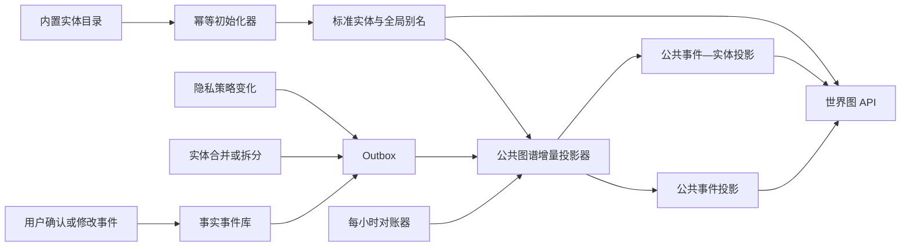

# 世界实体库与公共图谱同步设计

## 1. 目标

本设计为织络增加两个基础能力：

1. 通过可重复执行的初始化程序写入一批现实生活中常见、可安全跨用户复用的标准实体。
2. 将用户明确设为公开的正式事件持续投影到世界图，并通过实时增量更新与每小时完整对账保证一致性。

本阶段不从互联网抓取新闻、活动、地图、影视或音乐数据。外部供应商只预留来源、游标和同步运行模型，待明确数据源、许可与更新语义后接入。

## 2. 数据域边界

系统必须区分三类事实：

| 数据域 | 所有者 | 是否进入用户时间线 | 是否进入世界图 |
| --- | --- | --- | --- |
| 用户生活事件 | 单个用户 | 是 | 仅在用户明确设为公开后进入 |
| 标准实体目录 | 平台 | 否 | 在“全部实体”范围可独立浏览；被公开事件引用后进入活跃关系，也用于事件解析归一化 |
| 外部公共事件（后续） | 外部来源 | 否 | 经来源验证、清洗和状态管理后进入 |

外部数据不得伪装成用户经历，不得触发“用户喜欢、去过、看过”等推断。用户只有主动记录并确认后，才与标准实体或未来的外部事件建立个人事实关系。

## 3. 总体架构



世界图 API 不再遍历所有私人事件并逐条计算隐私，而是只读取已经完成隐私判定和降精度处理的公共投影。

世界图默认显示“关联实体”，避免大量孤立节点干扰关系探索；用户切换到“全部实体”后，可以浏览经过来源验证的标准实体目录。目录实体可以是孤立节点，但系统不得为其伪造用户、事件或关系。只有带 `canonical_entity_sources` 来源记录且状态正常、非敏感的实体能进入该范围，防止私人记录产生的临时标准实体泄露到世界图。

## 4. 标准实体初始化

### 4.1 可初始化的实体

- 常见 App、数字平台和服务。
- 通用食物、饮品。
- 常见游戏和内容产品。
- 具有稳定公共身份的品牌或作品。

不批量初始化家庭地址、医院、宗教场所、私人地点和人物。公共地点后续应由地图供应商按需搜索和确认，不能只按名称跨用户合并。

### 4.2 来源与唯一性

`canonical_entities` 继续保存标准实体主体，新增 `canonical_entity_sources` 保存平台或供应商身份：

```text
(source_key, external_id) 唯一
```

内置目录使用：

```text
source_key = traceweave_builtin
external_id = <entity_type>:<稳定标识>
```

新增 `canonical_entity_aliases` 保存全局安全别名。用户自己的称呼和备注仍留在 `user_entities` 与 `entity_aliases`，不会被目录覆盖。

### 4.3 幂等规则

初始化程序必须：

- 在事务中运行并取得数据库 advisory lock。
- 优先按来源 ID 复用实体，再按实体类型和规范名称复用。
- 重复执行只更新时间、版本和安全元数据，不重复建实体。
- 不自动拆分、合并用户已有实体。
- 为每次运行记录新增、更新、忽略和失败数量。

## 5. 公共图谱投影

### 5.1 公共事件投影

`public_event_projections` 只包含世界图允许读取的字段：

- 事件 ID、所有者账户 ID。
- 标题、活动类型、事实状态。
- 降精度到日期的发生时间和创建时间。
- 生效隐私策略版本。
- 投影生成时间。

不包含原始输入、附件、精确时间、精确坐标、私人别名和未确认人物身份。

### 5.2 公共实体边

`public_event_entity_projections` 只保存：

- 已公开事件 ID。
- 非敏感、仍有效的标准实体 ID。
- 关系角色。

没有标准实体引用的私人实体不会进入公共投影。浏览器定位记录不会直接投影；公共地点只有在安全地归一化为非敏感标准地点后才可进入。

### 5.3 撤权

以下操作必须立即删除或重建投影：

- 公开改为好友、圈子、私密或隔离。
- 删除事件。
- 停用或删除账户。
- 实体被标记为敏感、合并、拆分或废弃。
- 上层隐私策略变化导致事件不再公开。

投影是派生读模型，可以从事实事件、标准实体和隐私策略完整重建。

## 6. 同步策略

### 6.1 实时增量

现有 Outbox 消费者处理以下事件时，同时刷新公共图谱投影：

- `event.confirmed`
- `event.updated`
- `event.deleted`
- `event.privacy_updated`
- `privacy_policy.updated`
- `entity_memory.updated`
- `account.deleted`

单事件变化只刷新该事件；用户默认、类别或实体策略变化刷新受影响事件或该用户的投影。

### 6.2 每小时对账

后台 worker 默认每 3600 秒执行一次完整对账，并在服务启动时执行一次。对账器：

1. 获取全局 advisory lock，避免多实例重复运行。
2. 枚举正式事件与已有投影的并集。
3. 使用统一隐私求值器重新判断公开状态。
4. 幂等更新公开事件和实体边，撤销已经失效的投影。
5. 在 `world_sync_runs` 写入结果和错误。

实时投影提供低延迟，每小时对账用于修复进程崩溃、历史数据和代码升级造成的不一致，不能替代实时撤权。

## 7. 外部数据源扩展

未来外部适配器统一实现：

```ts
interface WorldSourceAdapter {
  sourceKey: string;
  pull(cursor: Record<string, unknown> | null): Promise<{
    entities: ExternalEntityRecord[];
    events: ExternalWorldEventRecord[];
    nextCursor: Record<string, unknown> | null;
  }>;
}
```

外部同步必须具备来源 URL、授权或许可、外部 ID、原始摘要校验、抓取时间、删除/下架状态和游标。外部公共事件使用独立表，不复用用户 `events`。

## 8. 运行方式

```bash
npm run db:migrate
npm run db:seed:world-entities
npm run world:sync
```

- `db:seed:world-entities`：只同步内置标准实体目录。
- `world:sync`：执行一次实体同步和公共图谱完整对账，可供运维或 Cron 手动调用。
- API 进程内 worker：处理 Outbox 实时刷新，并按 `WORLD_SYNC_INTERVAL_SECONDS` 幂等同步内置目录、完整对账公共投影。部署新目录版本后不依赖人工补跑初始化命令。

## 9. 可观测性与验收

需要观测：

- 最近一次成功对账时间。
- 最近一次失败及错误。
- 公共事件投影数、公共实体边数。
- 本次新增、更新、撤销数量。
- Outbox 延迟和死信数量。

验收条件：

1. 初始化脚本连续执行两次，不增加重复实体和别名。
2. 私密事件不会产生公共投影。
3. 事件改为公开后，Outbox 消费完成即可出现在世界图。
4. 公开事件改回私密或删除后，世界图节点和边被撤销。
5. 每小时对账能修复手工删除的投影或历史遗漏。
6. 世界图 API 不读取原始记录、附件和精确定位表。
7. 多实例同时对账时只有一个实例实际执行。

## 10. 规模演进

当前公共投影解决了请求时全表隐私求值问题。数据规模继续增长后，世界图 API 还需要增加游标、时间窗、关系深度、节点聚类和视口加载。产品语义仍然是全站公共图谱，但浏览器不应一次接收全部节点。
