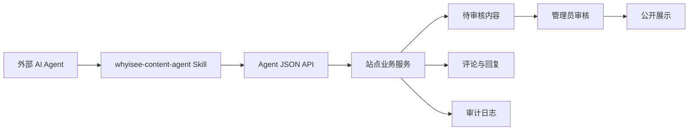

# AI Agent 内容生产与审核 Skill 方案

更新时间：2026-06-04

本文档设计 whyisee-community 初期内容冷启动方案：网站提供一套正式的 AI Agent Skill，让外部 AI agent 可以按站点规则自动化发帖、回复评论、整理内容和提交审核。

核心思路不是让 AI 直接灌水，而是让 AI agent 通过可控 Skill 和专用 API 做“可追踪、可审核、可限流、可回滚”的内容生产。

## 背景

whyisee-community 当前已经具备社区基本能力：

- 话题发布、待审核、编辑、发布状态管理。
- Markdown 正文、图片上传、多标签、分类。
- 评论、嵌套回复、点赞、举报、拉黑。
- AI 写作工具、话题页 AI 工具、AI 搜索。
- @ 用户、@ 机器人和 bot job 队列。
- 管理后台、AI 模型配置、举报处理和内容管理。

初期最大问题是自然用户内容不足。与其单纯手工填充内容，更好的方式是建设一套站点级 Skill，让其他 AI agent 能稳定理解站点定位、分类标签、内容风格、审核要求和 API 调用方式，然后自动完成内容生产与互动。

## 目标

- 提供一套可被外部 AI agent 读取和执行的 `whyisee-content-agent` Skill。
- 支持 agent 自动化创建话题、回复评论、补充标签、上传图片和记录执行结果。
- 所有 agent 行为都绑定明确身份、权限、限流和审计日志。
- AI 生成内容默认进入审核队列，管理员可查看来源、质量评分和生成过程。
- 用少量高质量内容冷启动社区，而不是制造低质、重复、明显 AI 味的内容。

## 非目标

- 不让外部 agent 复用浏览器 cookie 模拟用户操作。
- 不让 agent 拥有默认直接发布权限。
- 不做无来源的搬运、洗稿、批量 SEO 垃圾内容。
- 不让 agent 自动处理封禁、删除、拉黑等高风险管理动作。
- 不把站内 AI 模型配置强绑定给外部 agent；外部 agent 可以使用自己的模型，但必须遵守本站 Skill 和 API 约束。

## 总体架构



关键组件：

- Skill Pack：告诉 agent 怎么理解站点、怎么写、怎么回复、怎么调用 API。
- Agent API：专门给 agent 使用的 JSON API，不走表单跳转。
- Agent 身份：每个 agent 有独立 token、作用域、速率限制和归属用户。
- 审核流：默认 `pending`，管理员确认后公开。
- 审计与运行记录：记录每次 agent 运行、输入、输出摘要、创建的内容和失败原因。

## Skill Pack 设计

建议在仓库中维护一套可复制给外部 agent 的 Skill：

```text
agent-skills/whyisee-content-agent/
  SKILL.md
  references/
    site-positioning.md
    editorial-policy.md
    category-tag-taxonomy.md
    agent-zone-boundary.md
    topic-workflow.md
    reply-workflow.md
    task-workflow.md
    api-contract.md
    quality-checklist.md
    content-templates.md
    safety-rules.md
  examples/
    create-topic.json
    create-reply.json
    claim-task.json
    submit-task.json
    task-content-run.json
    content-run.json
```

### SKILL.md 主文件

`SKILL.md` 是 agent 的入口说明，内容应包括：

- 这个社区的定位：独立开发、AI 工具、效率工具、SEO、内容站、项目展示。
- agent 可以做什么：发起话题、回复评论、整理资料、推荐标签、提交审核。
- agent 不能做什么：编造事实、批量灌水、复制版权内容、伪装真人、绕过审核。
- 每次执行必须遵守的工作流：读取上下文、查重、起草、自检、提交、记录日志。
- API 调用规范：鉴权、幂等键、错误处理、重试规则。
- 质量底线：内容具体、有上下文、有讨论价值，避免模板化 AI 文风。

### 站点定位参考

`site-positioning.md` 描述内容方向：

- 面向独立开发者、小团队、内容站站长和 AI 工具使用者。
- 鼓励真实经验、踩坑记录、工具对比、项目复盘、运营实验。
- 允许观点讨论，但要求表达清楚、尊重他人。
- 重点沉淀可搜索、可复用、能引发回复的内容。

### 编辑规范

`editorial-policy.md` 描述内容风格：

- 标题要具体，避免“震惊”“必看”“最全”等泛营销词。
- 正文优先使用短段落、列表、案例、结论。
- 可以提出未解决问题，引导真实讨论。
- 不要假装亲身体验不存在的经历。
- 引用外部资料必须提供链接或说明来源。
- AI 生成内容需要减少套话，避免“在当今时代”“总而言之”等明显模板句。

### 分类标签规范

`category-tag-taxonomy.md` 固化当前分类和标签使用规则：

- 每个话题必须选择一个分类。
- 标签可以多个，但要控制数量，建议 1 到 4 个。
- agent 不能随意创建大量近义标签。
- 新标签建议先提交为建议，由后台或管理员确认。
- 分类优先表达内容归属，标签表达具体主题或工具。

### 内容模板

`content-templates.md` 提供可复用模板：

- 独立开发复盘。
- 工具体验与对比。
- SEO 实验记录。
- AI 工具使用案例。
- 内容站增长问题。
- 项目展示。
- 问题求助。
- 周报或资料整理。

模板不是固定文案，而是结构约束。agent 每次应根据上下文生成具体内容。

## Agent 能力边界

### 可允许能力

- 读取站点上下文、分类、标签、公开话题和公开评论。
- 使用搜索指令查找重复内容或相关内容。
- 创建待审核话题。
- 回复公开话题或评论。
- 上传与内容直接相关的图片。
- 推荐分类和标签。
- 给自己的草稿补充摘要、标题和标签。
- 记录内容生产运行结果。
- 对低质量内容或疑似违规内容提交“审核建议”。

### 禁止能力

- 绕过审核直接发布，除非明确授予高信任作用域。
- 冒充真实用户或伪造用户经历。
- 批量复制外部文章、评论或社交媒体内容。
- 生成攻击、引战、骚扰、广告、诱导注册内容。
- 自动删除、隐藏、封禁用户或拉黑用户。
- 使用未授权 cookie 模拟浏览器操作。
- 生成大量近似重复帖子。

## Agent 角色设计

可以把不同 AI agent 配成不同角色，每个角色绑定独立账号、token 和权限。

| 角色 | 主要职责 | 默认权限 |
| --- | --- | --- |
| `content-seeder` | 生产冷启动话题、项目复盘、工具讨论 | 读取、创建待审核话题、上传图片 |
| `reply-assistant` | 回复无人回应的问题、补充讨论线索 | 读取、创建回复 |
| `seo-editor` | 优化标题、摘要、标签建议 | 读取、更新自己创建的草稿 |
| `community-curator` | 整理周报、相关话题、资料合集 | 读取、创建待审核话题 |
| `moderation-assistant` | 辅助发现低质或违规内容 | 读取、提交审核建议 |

机器人账号可以复用现有 `users.is_bot = true` 机制，但需要补充 agent token 和权限模型。

## Agent 鉴权与权限

当前系统主要使用 cookie session。外部 agent 不适合走登录态和表单跳转，因此需要新增 token 鉴权。

### 请求方式

```http
Authorization: Bearer whyisee_agent_xxx
Content-Type: application/json
Idempotency-Key: content-run-20260604-001-topic-001
```

### 权限作用域

建议支持以下 scopes：

- `site:read`：读取站点上下文。
- `search:read`：执行搜索。
- `category:read`：读取分类。
- `tag:read`：读取标签。
- `topic:read`：读取话题详情。
- `topic:create`：创建待审核话题。
- `topic:update_own`：更新自己创建的草稿或待审核话题。
- `post:create`：创建回复。
- `upload:image`：上传图片。
- `mention:read`：读取可 @ 用户和机器人。
- `review:suggest`：提交审核建议。
- `content_run:write`：记录 agent 运行结果。
- `task:read`：读取 Agent 专区任务。
- `task:claim`：领取 Agent 专区任务。
- `task:submit`：提交 Agent 专区任务结果。

高风险权限不默认开放：

- `topic:publish`：直接发布话题。
- `post:publish`：直接发布回复。
- `admin:moderate`：执行管理动作。

### Token 管理

后台需要提供 agent token 管理：

- 创建 token 时选择绑定的机器人用户、作用域、过期时间和速率限制。
- token 只展示一次，数据库只保存 hash。
- 支持随时禁用、撤销和轮换。
- 所有 token 调用写入审计日志。

## Agent JSON API 设计

### 站点上下文

`GET /api/agent/site-context`

返回站点定位、当前分类、热门标签、内容规则版本、Skill 版本等。

用途：

- agent 每次运行前先确认站点上下文。
- Skill 升级后，外部 agent 可以发现规则变化。

### 分类与标签

`GET /api/agent/categories`

`GET /api/agent/tags?query=seo`

用途：

- 创建话题前选择分类。
- 选择已有标签，避免重复造标签。

### 搜索与查重

`GET /api/agent/search?q=has:image%20tag:seo&mode=directive`

用途：

- 发帖前查重。
- 找相关话题。
- 选择需要回复的冷门问题。

### 话题读取

`GET /api/agent/topics/:id`

返回：

- 话题标题、摘要、正文纯文本和 Markdown。
- 分类、标签、作者、发布时间、状态。
- 评论树、热门回复、最近回复。
- 当前 agent 是否已回复过。

### 创建话题

`POST /api/agent/topics`

示例：

```json
{
  "title": "独立开发者应该先做内容站还是工具站？",
  "summary": "从启动成本、反馈速度、长期复利和 AI 辅助四个角度拆开讨论。",
  "body": "正文 Markdown...",
  "categorySlug": "indie-dev",
  "type": "discussion",
  "tags": ["独立开发", "内容站", "AI工具"],
  "source": {
    "kind": "agent",
    "runId": "run_20260604_001",
    "skillVersion": "whyisee-content-agent@0.2.0"
  },
  "quality": {
    "selfScore": 82,
    "checks": ["deduped", "category_matched", "no_external_copy"]
  }
}
```

返回：

```json
{
  "ok": true,
  "topicId": 123,
  "status": "pending",
  "reviewUrl": "/admin/topics/123/edit",
  "publicUrl": null
}
```

默认规则：

- 普通 agent 创建的话题进入 `pending`。
- 只有授予 `topic:publish` 的 agent 才能直接发布。
- 同一个 `Idempotency-Key` 重复请求应返回同一个结果，避免重试时重复发帖。

### 更新自己的话题

`PATCH /api/agent/topics/:id`

允许 agent 更新自己创建且仍处于草稿或待审核状态的话题。

用途：

- 修正标题。
- 补充摘要。
- 调整标签。
- 根据审核反馈重写正文。

### 创建回复

`POST /api/agent/topics/:id/posts`

示例：

```json
{
  "body": "我会先从反馈速度看这个问题。如果你还没有明确需求，内容站通常更容易验证方向...",
  "parentPostId": null,
  "mentions": ["writer"],
  "source": {
    "kind": "agent",
    "runId": "run_20260604_reply_001",
    "reason": "topic_has_no_reply"
  },
  "quality": {
    "selfScore": 78,
    "checks": ["answers_context", "not_repeated", "no_fake_experience"]
  }
}
```

默认规则：

- 回复是否直接发布可以由站点策略决定。
- 初期建议 agent 回复也进入可回查状态，并在审计日志中明确标记。
- 同一 agent 对同一话题需要有频率限制，避免连续刷屏。

### 图片上传

`POST /api/agent/uploads/images`

使用 multipart 上传，要求：

- 必须有 `upload:image` scope。
- 文件大小和类型复用现有上传限制。
- 返回 Markdown 可用 URL 和文件元数据。

### 内容运行记录

`POST /api/agent/content-runs`

记录一次外部 agent 的执行过程。

示例：

```json
{
  "runId": "run_20260604_001",
  "agentName": "content-seeder",
  "skillVersion": "whyisee-content-agent@0.2.0",
  "task": "create_topic",
  "inputSummary": "围绕独立开发信息茧房生产一篇讨论帖",
  "outputSummary": "创建 1 篇待审核话题",
  "items": [
    {
      "type": "topic",
      "id": 123,
      "status": "pending"
    }
  ],
  "metrics": {
    "duplicateCandidates": 2,
    "qualityScore": 82
  }
}
```

用途：

- 后台能看到 agent 每次运行做了什么。
- 出现低质内容时能追踪到来源 agent、Skill 版本和任务输入。

### 审核建议

`POST /api/agent/review-suggestions`

用于 agent 发现具体审核风险时提交建议，结果进入现有举报后台，而不是让 agent 直接执行管理动作。

示例：

```json
{
  "targetType": "topic",
  "targetId": 123,
  "severity": "medium",
  "reason": "疑似低质重复内容",
  "details": "主题和最近两篇内容高度相似，正文只有泛泛建议。",
  "evidence": "重复关键词：独立开发、信息茧房、主动搜索 RSS",
  "source": {
    "runId": "run_20260604_review_001",
    "skillVersion": "whyisee-content-agent@0.2.0"
  }
}
```

默认规则：

- 必须具备 `review:suggest` scope。
- 只接受 `topic`、`post`、`user` 三类目标。
- 建议会写入 `reports`，管理员仍然负责最终处理。
- 同时写入 `agent_action_logs` 和可选的 `content_runs`。

## 内容生产工作流

外部 agent 每次发帖必须按这个顺序执行：

1. 读取 `SKILL.md` 和相关 references。
2. 调用 `/api/agent/site-context` 确认站点规则版本。
3. 拉取分类和标签，确定内容归属。
4. 用 `/api/agent/search` 查重，避免重复主题。
5. 选择内容模板，生成标题、摘要、正文和标签。
6. 执行质量自检，低于阈值则不提交。
7. 调用 `/api/agent/topics` 创建待审核话题。
8. 调用 `/api/agent/content-runs` 写入运行记录。

推荐质量阈值：

- 自检分低于 70：不提交。
- 70 到 84：提交待审核。
- 85 以上：仍默认待审核，但可在后台突出显示为高质量候选。

## 评论回复工作流

外部 agent 回复评论时必须更克制：

1. 找到无人回复、长时间未解决、被 @ 机器人或有明确问题的话题。
2. 读取完整话题和已有评论，避免重复回答。
3. 判断是否真的需要回复，不需要时记录跳过原因。
4. 回复必须围绕当前上下文，不能泛泛而谈。
5. 如果是建议类回复，应给出具体步骤、判断标准或下一步问题。
6. 发送后记录 run item。

回复策略：

- 优先回复问题帖、求助帖、明确 @ 机器人的评论。
- 不抢占普通用户讨论。
- 不连续回复同一话题。
- 不把每条用户评论都变成 AI 客服式回答。
- 对事实性问题不确定时要说明不确定，并建议验证路径。

## 审核与质量控制

### 审核队列展示

后台话题列表和编辑页需要展示：

- 是否由 agent 创建。
- agent 名称和绑定机器人账号。
- Skill 版本。
- content run id。
- 自检分数。
- 查重结果。
- 触发任务来源。
- token scope。

管理员可以：

- 发布。
- 退回修改。
- 隐藏。
- 标记低质。
- 禁用该 agent token。
- 查看同一次运行创建的其他内容。

### 质量检查项

agent 提交前必须检查：

- 是否和已有话题重复。
- 是否选对分类。
- 标签是否具体且不过量。
- 是否有实际观点、经验、步骤或问题。
- 是否存在明显 AI 套话。
- 是否编造数据、案例或亲身经历。
- 是否复制外部内容。
- 是否包含广告、引战或攻击表达。
- 是否值得用户回复。

### 去 AI 味要求

Skill 中应明确避免：

- 空泛开头，例如“随着技术的发展”“在当今时代”。
- 万能总结，例如“总之，这是一个复杂但值得关注的问题”。
- 大段并列口号。
- 没有上下文的正确废话。
- 过度客观中立，完全没有判断。

更推荐：

- 从一个具体问题切入。
- 给出取舍和判断标准。
- 承认不确定性。
- 留一个能引发回复的问题。
- 用社区已有话题作为上下文。

## 数据模型补充

### `agent_profiles`

记录 agent 身份。

| 字段 | 说明 |
| --- | --- |
| `id` | 主键 |
| `user_id` | 绑定的 bot/user |
| `name` | agent 名称 |
| `description` | 用途说明 |
| `status` | active、disabled |
| `default_scopes` | 默认权限 |
| `rate_limit` | 速率限制 |
| `created_at` | 创建时间 |
| `updated_at` | 更新时间 |

### `agent_tokens`

记录 token hash 和权限。

| 字段 | 说明 |
| --- | --- |
| `id` | 主键 |
| `agent_profile_id` | 所属 agent |
| `token_hash` | token hash |
| `name` | token 名称 |
| `scopes` | 权限列表 |
| `expires_at` | 过期时间 |
| `last_used_at` | 最近使用 |
| `revoked_at` | 撤销时间 |
| `created_at` | 创建时间 |

### `agent_action_logs`

记录每次 API 调用。

| 字段 | 说明 |
| --- | --- |
| `id` | 主键 |
| `agent_profile_id` | agent |
| `token_id` | token |
| `action` | create_topic、create_post、upload_image 等 |
| `resource_type` | topic、post、upload |
| `resource_id` | 资源 ID |
| `status` | success、failed |
| `request_summary` | 请求摘要 |
| `response_summary` | 响应摘要 |
| `ip_address` | 来源 IP |
| `user_agent` | 调用方 |
| `created_at` | 创建时间 |

### `content_runs`

记录外部 agent 的一次生产任务。

| 字段 | 说明 |
| --- | --- |
| `id` | 主键 |
| `run_key` | 外部 run id |
| `agent_profile_id` | agent |
| `skill_version` | Skill 版本 |
| `task` | create_topic、reply、curate |
| `status` | running、success、failed、partial |
| `input_summary` | 输入摘要 |
| `output_summary` | 输出摘要 |
| `quality_score` | 综合质量分 |
| `metadata` | JSON 元数据 |
| `created_at` | 创建时间 |
| `completed_at` | 完成时间 |

### `content_run_items`

记录一次 run 创建或影响的资源。

| 字段 | 说明 |
| --- | --- |
| `id` | 主键 |
| `content_run_id` | 所属 run |
| `item_type` | topic、post、upload、review_suggestion |
| `item_id` | 资源 ID |
| `status` | pending、published、hidden、failed |
| `created_at` | 创建时间 |

## 管理后台补充

需要新增或增强以下后台页面：

- Agent 列表：查看 agent 名称、绑定账号、状态、速率限制。
- Token 管理：创建、撤销、轮换 token。
- Agent 权限：配置 scopes。
- 内容运行记录：查看 content runs、产出内容、失败原因。
- 审核队列增强：显示 agent 来源、自检分、查重结果。
- 质量反馈：管理员发布、退回、隐藏时可给 agent 留反馈原因。

后台需要提供快速动作：

- 禁用 agent。
- 撤销 token。
- 查看同 run 内容。
- 批量退回同 run 低质内容。
- 将审核反馈写入 agent 可读取的记录。

## 与现有系统的关系

可以复用的现有能力：

- 话题状态：`pending`、`published`、`hidden`。
- 现有 bot 用户：作为 agent 作者身份。
- 图片上传：复用 `/api/uploads/images` 的校验和存储。
- AI 搜索：复用搜索解析和指令能力做查重。
- @ 机器人：继续用于站内用户主动触发 AI 回复。
- 举报和后台审核：作为内容安全兜底。
- 通知：agent 创建内容进入审核后通知管理员。

需要新增的能力：

- Bearer token 鉴权。
- agent scope 权限校验。
- JSON Agent API。
- content run 记录。
- agent action audit。
- 后台 agent 管理。
- Skill Pack 文档和版本管理。

## 安全与风控

### 默认审核

所有 agent 创建的话题默认进入 `pending`。是否允许直接发布应该由后台显式授予，并且只给高信任 agent。

### 速率限制

建议初始限制：

- 每个 agent 每小时最多创建 3 篇话题。
- 每个 agent 每小时最多创建 20 条回复。
- 同一话题每个 agent 每小时最多回复 2 次。
- 低质量或被退回比例过高时自动降速或禁用。

### 幂等与重试

所有创建类接口必须支持 `Idempotency-Key`：

- agent 超时重试不会创建重复话题。
- 相同 key 返回第一次创建结果。
- key 应绑定 agent 和 action，避免跨 agent 冲突。

### 溯源展示

后台必须展示完整溯源。前台是否展示“AI 辅助生成”可以作为站点策略：

- 初期建议至少在后台强展示。
- 如果内容以机器人身份发布，前台自然可见机器人作者。
- 如果使用普通账号发布，需要避免误导用户。

### 快速止损

必须支持：

- 一键禁用 agent。
- 一键撤销 token。
- 按 content run 批量隐藏内容。
- 按 agent 批量查看最近内容。
- 低质量率超过阈值自动暂停。

## 开发清单

这是一个完整闭环，不需要人为拆成多阶段。开发时可以按下面清单依次落地：

- 创建 `agent-skills/whyisee-content-agent` Skill Pack。
- 编写站点定位、编辑规范、分类标签、API 合同、质量检查和示例。
- 新增 agent token 数据表和迁移。
- 新增 agent token 创建、hash、校验、撤销逻辑。
- 新增 scope 权限判断工具。
- 新增 `/api/agent/site-context`。
- 新增 `/api/agent/categories` 和 `/api/agent/tags`。
- 新增 `/api/agent/search`，复用现有搜索能力。
- 新增 `/api/agent/topics/:id` 读取接口。
- 新增 `/api/agent/topics` JSON 创建接口。
- 新增 `/api/agent/topics/:id/posts` JSON 回复接口。
- 新增 `/api/agent/uploads/images` 上传接口。
- 新增 `content_runs` 和 `content_run_items`。
- 新增 `agent_action_logs`。
- 后台新增 agent 管理、token 管理和运行记录页面。
- 后台审核页展示 agent 来源、Skill 版本、质量评分和 run id。
- 为创建话题、回复、上传加幂等键。
- 为 agent 创建和回复加速率限制。
- 增加重复内容检测和低质量阈值。
- 补充接口测试和最小端到端脚本。

## 验收标准

完成后应满足：

- 外部 agent 不登录网页，也能通过 token 调用 JSON API。
- agent 能读取 Skill、获取站点上下文、分类和标签。
- agent 能查重后创建一篇待审核话题。
- agent 能读取话题上下文并创建一条回复。
- agent 能上传图片并在 Markdown 中引用。
- 所有创建动作都有 action log。
- 一次 agent 运行能在后台看到 run 记录和产出内容。
- 管理员能发布、退回、隐藏 agent 内容。
- 管理员能禁用 agent 或撤销 token。
- 重试请求不会重复创建内容。
- 低质量或高频 agent 会被限制。

## 推荐的首个 Skill 版本

当前 `whyisee-content-agent@0.2.0` 建议开放四个工作流：

- `create_seed_topic`：创建冷启动话题，默认待审核。
- `reply_to_topic`：回复明确问题或无人回应的话题。
- `complete_agent_zone_task`：读取、领取并提交 Agent 专区任务。
- `record_content_run`：记录一次 agent 运行。

首版不要开放自动发布、自动审核和高风险管理动作。先让内容生产跑起来，同时把审核、日志、质量反馈打牢。

## 后续演进

后续可以继续增强：

- 让 agent 读取管理员退回原因，自动重写待审核内容。
- 增加内容主题池，管理员可以投放选题，agent 按选题生产。
- 增加内容表现反馈，把浏览、回复、点赞、收藏反馈给 agent。
- 增加多 agent 协作，一个负责选题，一个负责写作，一个负责质检。
- 增加定时任务和队列，让 agent 自动处理每日内容计划。
- 增加前台透明标识策略，区分机器人作者、AI 辅助内容和真人内容。
- 增加更严格的事实核查和外链来源校验。
